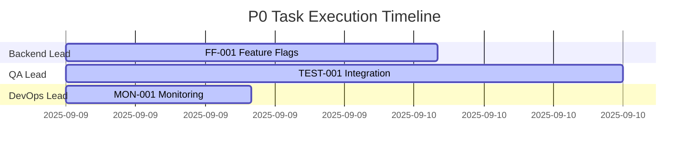

# P0 Task Execution Status Report

**Generated**: 2025-09-09 09:00 UTC  
**Report Type**: Master Orchestrator Status  
**Priority Level**: P0 - CRITICAL  
**Deadline**: 2025-09-10 09:00 UTC (24 hours remaining)  

## Executive Summary

The RuleIQ project has **1 of 4 P0 tasks completed** (25%). SEC-001 authentication vulnerability has been successfully fixed and deployed with feature flag protection. Three critical infrastructure tasks remain with 24-hour deadline enforcement.

## P0 Task Status

| Task | Status | Progress | Risk Level | Notes |
|------|--------|----------|------------|-------|
| SEC-001 | ✅ COMPLETE | 100% | None | Authentication bypass fixed, v2 middleware deployed |
| FF-001 | 🔄 TODO | 0% | Low | 16h effort, clear implementation plan ready |
| TEST-001 | 🔄 TODO | 0% | Low | 24h effort, can run parallel with FF-001 |
| MON-001 | 🔄 TODO | 0% | Low | 8h effort, can run parallel |

## Current State Analysis

### ✅ Accomplishments
1. **SEC-001 Complete**: Authentication vulnerability patched with backward compatibility
2. **Feature flag foundation exists**: Basic implementation ready for enhancement
3. **Test infrastructure present**: Good starting point for expansion
4. **Clear execution plans**: All tasks have detailed handoff documents

### 🎯 Immediate Actions Required

#### Action 1: Start FF-001 (Backend Lead)
- **What**: Enhance feature flags with persistence and admin UI
- **Why**: Unblocks all future feature deployments
- **How**: Follow `.bmad-core/handoffs/FF-001-feature-flags-handoff.md`
- **Deadline**: 16 hours from start

#### Action 2: Start TEST-001 (QA Lead)
- **What**: Setup testcontainers and CI/CD pipeline
- **Why**: Quality gate to prevent regressions
- **How**: Follow `.bmad-core/handoffs/TEST-001-integration-tests-handoff.md`
- **Deadline**: 24 hours from start

#### Action 3: Start MON-001 (DevOps Lead)
- **What**: Deploy Prometheus/Grafana with auto-rollback
- **Why**: Protect users from bad deployments
- **How**: Follow `.bmad-core/handoffs/MON-001-monitoring-handoff.md`
- **Deadline**: 8 hours from start

## Resource Allocation

## Risk Assessment

| Risk | Probability | Impact | Mitigation |
|------|------------|--------|------------|
| FF-001 database migration fails | Low | High | Test in staging first |
| TEST-001 CI/CD setup delays | Medium | Medium | Use GitHub Actions templates |
| MON-001 Docker issues | Low | Low | Fallback to manual deployment |
| Resource conflicts | Low | Medium | Tasks can run in parallel |

## Success Criteria

### Gate Requirements for P0 → P1 Progression
1. ✅ All authentication vulnerabilities fixed (COMPLETE)
2. ⏳ Feature flags system operational with persistence
3. ⏳ Integration tests achieving 80% coverage
4. ⏳ Monitoring stack deployed with auto-rollback
5. ⏳ All P0 acceptance criteria met

## Escalation Triggers

⚠️ **Escalate immediately if**:
- Any task blocked for >2 hours
- Resource unavailable when needed
- Critical dependency failure
- Security issue discovered
- Task falling behind schedule (50% time elapsed, <50% complete)

## Quality Checkpoints

### Hour 6 Checkpoint (15:00 UTC)
- [ ] FF-001: Database models created and migrated
- [ ] TEST-001: Testcontainers working
- [ ] MON-001: Docker stack running

### Hour 12 Checkpoint (21:00 UTC)
- [ ] FF-001: Service layer complete with tests
- [ ] TEST-001: SEC-001 validation tests passing
- [ ] MON-001: Metrics exposed and collected

### Hour 18 Checkpoint (03:00 UTC)
- [ ] FF-001: API endpoints functional
- [ ] TEST-001: CI/CD pipeline running
- [ ] MON-001: Rollback system tested

### Hour 24 Gate (09:00 UTC)
- [ ] All P0 tasks complete
- [ ] Integration tests passing
- [ ] No critical bugs
- [ ] Documentation updated

## Communication Protocol

### Status Updates
- **Every 2 hours**: Progress update in #engineering
- **Every 6 hours**: Checkpoint review with leads
- **On completion**: Task handoff notification
- **On blocker**: Immediate escalation

### Channels
- **Primary**: #ruleiq-p0-execution
- **Escalation**: #engineering-oncall
- **Status**: #daily-standup
- **Incidents**: #incidents

## Files & Resources

### Implementation Plans
- `/home/omar/Documents/ruleIQ/.bmad-core/handoffs/P0-TASK-EXECUTION-PLAN.md`
- `/home/omar/Documents/ruleIQ/.bmad-core/handoffs/FF-001-feature-flags-handoff.md`
- `/home/omar/Documents/ruleIQ/.bmad-core/handoffs/TEST-001-integration-tests-handoff.md`
- `/home/omar/Documents/ruleIQ/.bmad-core/handoffs/MON-001-monitoring-handoff.md`

### Task State
- `/home/omar/Documents/ruleIQ/.bmad-core/orchestrator/task-state.json`

### Code Locations
- Feature Flags: `/config/feature_flags.py`
- Integration Tests: `/tests/integration/`
- Monitoring: `/monitoring/`

## Next Steps After P0

Upon successful P0 completion:
1. **Validate**: Run full regression suite
2. **Deploy**: Stage all changes in staging environment
3. **Gate Review**: Confirm all P0 criteria met
4. **P1 Kickoff**: Begin API performance optimization
5. **Documentation**: Update all technical docs

## Support & Questions

- **Orchestrator**: Available 24/7 for coordination
- **Archon MCP**: Running on port 3737 for task management
- **Technical Lead**: On-call for critical decisions
- **Security Team**: Available for SEC-001 validation

---

**CRITICAL REMINDER**: 
- P0 deadline is ABSOLUTE - 24 hours from now
- NO P1 work until ALL P0 tasks complete
- Quality gates are non-negotiable
- Escalate proactively, not reactively

**Current Time**: 2025-09-09 09:00 UTC  
**Deadline**: 2025-09-10 09:00 UTC  
**Time Remaining**: 24 hours

---

*This report is the source of truth for P0 execution. Update task-state.json as progress is made.*