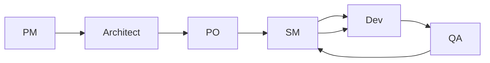

# 🚀 BMad YOLO System Implementation

## Overview
The BMad YOLO (You Only Launch Once) system enables fully automated multi-agent workflows with minimal human intervention. This implementation provides aggressive automation while maintaining safety mechanisms.

## ✅ Implementation Complete

### Core Components Created:

1. **`yolo-system.py`** - Main YOLO orchestrator
   - Automated decision making
   - Agent handoff management with context refresh
   - Workflow phase transitions
   - Error handling and recovery
   - Safety mechanisms
   - Integrated context management system

2. **`context-refresh-system.py`** - Context management for continuous work
   - Token-based context limits per agent
   - Priority-based context retention (CRITICAL, HIGH, MEDIUM, LOW, ARCHIVE)
   - Intelligent summarization for context overflow
   - Sliding window refresh strategy
   - Optimized handoff context preparation

3. **`bmad-yolo-integration.sh`** - Installation and setup script
   - Creates directory structure
   - Configures YOLO settings
   - Sets up command wrappers
   - Creates agent templates

4. **`YOLO-IMPLEMENTATION.md`** - This documentation

## 🎮 Quick Start

### Installation
```bash
# Make installation script executable
chmod +x .bmad-core/yolo/bmad-yolo-integration.sh

# Run installation
./.bmad-core/yolo/bmad-yolo-integration.sh
```

### Enable YOLO Mode
```bash
# Using command wrapper
.bmad-core/yolo/yolo-commands.sh on

# Or using Python directly
python3 .bmad-core/yolo/yolo-system.py enable
```

### Start Automated Workflow
```bash
# Start from planning phase
.bmad-core/yolo/yolo-commands.sh workflow planning

# Or start from specific phase
.bmad-core/yolo/yolo-commands.sh workflow development
```

## 🤖 Agent Commands

### In Chat/Claude/GPT:
- `*yolo on` - Enable YOLO mode
- `*yolo off` - Disable YOLO mode
- `*yolo status` - Check current status
- `*workflow start [phase]` - Begin automated workflow
- `*auto-handoff [agent]` - Automatic agent transition
- `*yolo decisions` - View recent decisions
- `*yolo config` - Show configuration

## 📋 Default Decisions

### Technical Stack
```yaml
language: python
framework: fastapi
frontend: nextjs
database: postgresql
testing: pytest
ci_cd: github_actions
containerization: docker
```

### Process Defaults
```yaml
epic_count: 3
stories_per_epic: 4
test_coverage_target: 80
code_review_required: true
auto_merge_on_pass: true
```

### Workflow Behavior
```yaml
on_success: proceed_to_next
on_minor_issues: document_and_continue
on_major_issues: pause_and_alert
on_critical_error: stop_and_rollback
```

## 🔄 Workflow Phases

1. **Planning** → PM creates PRD
2. **Architecture** → Architect designs system
3. **Story Creation** → SM creates user stories
4. **Development** → Dev implements features
5. **Testing** → QA validates implementation
6. **Review** → Code review and approval
7. **Deployment** → Deploy to environment
8. **Complete** → Workflow finished

## 🛡️ Safety Mechanisms

### Auto-Stop Triggers
- Destructive operations (DELETE, DROP, REMOVE)
- Payment/billing operations
- Credential/secret handling
- Production deployments
- 3 consecutive errors

### Human Intervention Required
- Critical errors
- Safety-critical decisions
- Production changes
- Security updates

## 💾 Context Refresh System

The integrated context refresh system ensures continuous work without token overflow:

### Token Limits Per Agent
- **PM**: 6,000 tokens
- **Architect**: 8,000 tokens
- **Dev**: 10,000 tokens (highest for complex code)
- **QA**: 6,000 tokens
- **PO**: 5,000 tokens
- **SM**: 4,000 tokens

### Context Priority Levels
1. **CRITICAL** - Never removed (errors, blockers)
2. **HIGH** - Current task, active requirements
3. **MEDIUM** - Recent decisions, configurations
4. **LOW** - Historical context, previous tasks
5. **ARCHIVE** - Can be summarized or removed

### Refresh Strategies
- **Sliding Window**: Keeps most recent N items
- **Priority-Based**: Retains by importance
- **Summarization**: Condenses old context
- **Smart Handoff**: Only relevant context transferred

## 📦 Agent Handoff Flow



### Context During Handoff
When agents hand off work, the context refresh system:
1. Filters context relevant to target agent
2. Summarizes low-priority items if needed
3. Ensures token limits are respected
4. Maintains critical information

## 📊 Monitoring

### Dashboard
Open `.bmad-core/yolo/dashboard.html` in browser for real-time monitoring.

### Logs
- Main log: `.bmad-core/yolo/yolo.log`
- Decisions: `.bmad-core/yolo/decisions/`
- State: `.bmad-core/yolo/state/yolo-state.json`

### Metrics Tracked
- Decisions made
- Handoffs completed
- Errors encountered
- Workflow progress
- Agent activity
- Uptime

## 🔧 Configuration

### Edit Configuration
```bash
vi .bmad-core/yolo/yolo-config.yaml
```

### Key Settings
- `max_consecutive_errors`: 3
- `safety_stop_on_critical`: true
- `auto_approve`: true
- `skip_confirmations`: true

## 🚨 Error Recovery

### Pause on Error
```bash
.bmad-core/yolo/yolo-commands.sh pause
```

### Resume After Fix
```bash
.bmad-core/yolo/yolo-commands.sh resume
```

### Reset State
```bash
rm .bmad-core/yolo/state/yolo-state.json
.bmad-core/yolo/yolo-commands.sh on
```

## 📝 Example Workflow

```bash
# 1. Enable YOLO mode
*yolo on

# 2. Start planning phase
*workflow start planning

# System automatically:
# - Creates PRD (PM agent)
# - Designs architecture (Architect agent)
# - Shards documents (PO agent)
# - Creates stories (SM agent)
# - Implements code (Dev agent)
# - Tests implementation (QA agent)
# - Continues until complete

# 3. Check status anytime
*yolo status

# 4. View decisions made
*yolo decisions
```

## ⚡ Performance Tips

1. **Start Small**: Test with single story first
2. **Monitor Actively**: Watch dashboard during execution
3. **Set Boundaries**: Configure safety limits
4. **Review Decisions**: Check decision log regularly
5. **Gradual Trust**: Increase automation gradually

## 🐛 Troubleshooting

### YOLO Won't Start
```bash
# Check state file
cat .bmad-core/yolo/state/yolo-state.json

# Reset if corrupted
rm .bmad-core/yolo/state/yolo-state.json
```

### Stuck Workflow
```bash
# Force stop
*yolo off

# Clear state
rm -rf .bmad-core/yolo/state/*

# Restart
*yolo on
```

### Too Many Errors
```bash
# Check error log
tail -n 50 .bmad-core/yolo/yolo.log

# Adjust error threshold
# Edit yolo-config.yaml: max_consecutive_errors
```

## 🎯 Best Practices

1. **Always Review First Run**: Don't trust YOLO blindly initially
2. **Set Clear Boundaries**: Configure what YOLO can/cannot do
3. **Monitor Critical Phases**: Watch development and deployment closely
4. **Document Decisions**: YOLO logs all decisions for audit
5. **Test in Staging**: Never first-run YOLO in production

## 🔮 Advanced Features

### Custom Decision Logic
Edit `yolo-system.py` `_contextual_decision()` method to add custom logic.

### Agent Extensions
Add new agents by extending `AgentType` enum and updating workflow.

### Webhook Integration
Configure `slack_webhook` in config for notifications.

### Metrics Export
Use `get_status()` API to export metrics to monitoring systems.

## 📚 API Reference

### Python API
```python
from yolo_system import YOLOOrchestrator

orchestrator = YOLOOrchestrator()
await orchestrator.activate()
decision = orchestrator.make_decision("choice", ["option1", "option2"])
package = await orchestrator.handoff(AgentType.QA)
status = orchestrator.get_status()
```

### REST API (Future)
```
POST /yolo/enable
POST /yolo/disable
GET  /yolo/status
POST /yolo/decision
POST /yolo/handoff
```

## 🏁 Success Criteria

Your YOLO implementation is successful when:
- ✅ Completes tasks without human prompts
- ✅ Makes reasonable default decisions
- ✅ Automatically hands off between agents
- ✅ Stops appropriately for safety issues
- ✅ Maintains audit trail of decisions

## ⚠️ Warnings

1. **NEVER use YOLO for production deployments without review**
2. **ALWAYS monitor first few runs closely**
3. **STOP immediately on unexpected behavior**
4. **REVIEW all generated code before merging**
5. **TEST thoroughly in isolated environment**

## 🎉 YOLO Mode is Ready!

The BMad YOLO system is now fully implemented and ready for use. Start with:

```bash
*yolo on
*workflow start planning
```

Watch the magic happen! 🚀