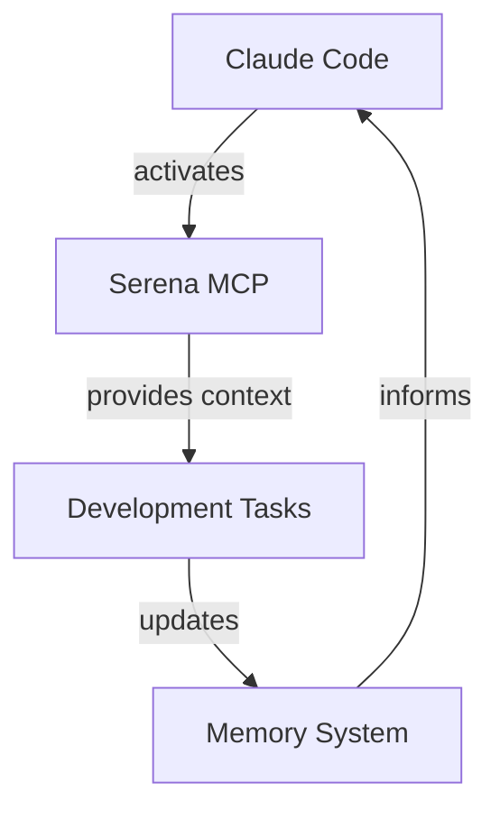

# RuleIQ Comprehensive Project Context
*Last Updated: 2025-08-07*

## 1. PROJECT OVERVIEW

### Core Mission
**ruleIQ** - AI-powered compliance automation platform for UK SMBs
- **Status**: 98% production-ready
- **Target Market**: UK Small-Medium Businesses requiring compliance automation
- **Value Proposition**: Enterprise-grade security with simplified compliance management

### Technology Stack
```yaml
Backend:
  - Language: Python 3.11+
  - Framework: FastAPI
  - Database: Neon PostgreSQL (cloud-hosted)
  - Cache/Queue: Redis
  - Task Processing: Celery workers
  - Security: JWT + AES-GCM encryption + RBAC

Frontend:
  - Framework: Next.js 15 (App Router)
  - Language: TypeScript
  - Runtime: React 19
  - UI Components: shadcn/ui (Radix-based)
  - State Management: 
    - Client: Zustand stores
    - Server: TanStack Query hooks
  - Styling: TailwindCSS with teal design system

Infrastructure:
  - Containerization: Docker Compose
  - Testing: Pytest (backend), Vitest (frontend), Playwright (E2E)
  - Code Quality: Ruff (Python), ESLint/Prettier (TypeScript)
```

### Key Architectural Decisions
1. **Enterprise Security**: Multi-layered auth with JWT + AES-GCM + RBAC middleware
2. **AI Resilience**: Circuit breaker pattern with fallback for all AI services
3. **Database Abstraction**: Field mappers handle legacy 16-char column truncation
4. **Microservice Design**: Modular service architecture with clear separation of concerns
5. **Performance Standards**: <200ms API response time requirement

### Team Conventions
- **IMMACULATE CODE PROTOCOL**: Zero warnings, zero errors mandate
- **TEST-FIRST Development**: Tests required before feature completion
- **Serena MCP Integration**: Enhanced code intelligence always active
- **Code Style**: 2-space indent, snake_case (Python), camelCase (TypeScript)

## 2. CURRENT STATE

### Recently Implemented
- ✅ Claude Code hooks system with enterprise-grade quality gates
- ✅ Hooks configuration in `.claude/settings.local.json`
- ✅ Serena MCP auto-activation for enhanced development
- ✅ Comprehensive memory system for project knowledge
- ✅ .superdesign folder cleanup and organization

### Work in Progress
- 🔄 **Teal Design System Migration** (65% complete)
  - Migrating from legacy purple/cyan to unified teal palette
  - Files affected: All frontend components and pages
  - Tracking: See `FRONTEND_CONDENSED_2025` memory

### Known Issues
1. **Database Column Truncation**
   - Legacy columns limited to 16 characters
   - Solution: Field mappers at `frontend/lib/api/business-profile/field-mapper.ts`
   - Examples: `handles_persona` → `handles_personal_data`

2. **Frontend Theme Inconsistencies**
   - Mixed purple/cyan legacy colors remain
   - Active migration to teal design system
   - Test with: `NEXT_PUBLIC_USE_NEW_THEME=true pnpm dev`

3. **Pre-existing TypeScript/ESLint Errors**
   - Some legacy warnings remain
   - Gradual cleanup in progress
   - Don't introduce new errors

### Performance Baselines
- **API Response**: <200ms average (✅ meeting target)
- **Test Coverage**: 671+ tests passing
- **Security Score**: 8.5/10
- **Build Time**: ~2-3 minutes (backend), ~1-2 minutes (frontend)
- **Rate Limits**: 100/min general, 20/min AI, 5/min auth

## 3. DESIGN DECISIONS

### Architectural Patterns

#### Circuit Breaker Pattern (AI Services)
```python
# All AI services use circuit breaker with fallback
services/ai/circuit_breaker.py
services/ai/fallback_system.py
services/ai/performance_optimizer.py
```

#### RBAC Middleware
```python
# Role-based access control for all endpoints
api/middleware/rbac_middleware.py
api/middleware/rbac_config.py
api/dependencies/rbac_auth.py
```

#### Field Mapper Pattern
```typescript
// Handles database column truncation
frontend/lib/api/business-profile/field-mapper.ts
// Maps: frontend names ↔ truncated DB columns
```

### API Design
- **RESTful Standards**: Consistent resource-based endpoints
- **Rate Limiting**: Tiered limits by endpoint type
- **Error Handling**: Standardized error responses with codes
- **Validation**: Pydantic schemas for all request/response

### Database Schema
- **Legacy Constraints**: 16-char column name limit
- **Relationships**: Properly defined foreign keys with CASCADE
- **Indexes**: Performance indexes on frequently queried columns
- **Migrations**: Alembic for schema versioning

### Security Implementation
```yaml
Authentication:
  - JWT tokens with refresh mechanism
  - AES-GCM encryption for sensitive data
  - RBAC with granular permissions

Validation:
  - Input sanitization on all endpoints
  - SQL injection prevention via ORM
  - XSS protection in frontend

Secrets:
  - No hardcoded values
  - Environment variables for configuration
  - Secure key generation utilities
```

## 4. CODE PATTERNS

### Backend Patterns (Python/FastAPI)

```python
# Service Layer Pattern
services/[feature]_service.py  # Business logic
api/routers/[feature].py       # HTTP endpoints
api/schemas/[feature].py       # Pydantic models
database/models/[feature].py   # SQLAlchemy models

# Error Handling
try:
    result = await service.process()
except ServiceException as e:
    logger.error(f"Service error: {e}")
    raise HTTPException(status_code=400, detail=str(e))

# AI Service Pattern
async def ai_operation():
    if circuit_breaker.is_open():
        return fallback_response()
    try:
        return await ai_service.process()
    except Exception as e:
        circuit_breaker.record_failure()
        return fallback_response()
```

### Frontend Patterns (TypeScript/Next.js)

```typescript
// State Management Pattern
// Zustand for client state
const useStore = create<StoreState>((set) => ({
  data: null,
  setData: (data) => set({ data })
}));

// TanStack Query for server state
const useData = () => {
  return useQuery({
    queryKey: ['data-key'],
    queryFn: fetchData
  });
};

// Component Pattern
export default function Component() {
  const { data, isLoading } = useData();
  const { clientState, setClientState } = useStore();
  
  if (isLoading) return <Skeleton />;
  return <div>{/* Component JSX */}</div>;
}
```

### Testing Patterns

```python
# Backend Testing
@pytest.mark.unit
async def test_service_function():
    # Arrange
    mock_data = create_mock_data()
    
    # Act
    result = await service.process(mock_data)
    
    # Assert
    assert result.status == "success"

# Fast test execution
# make test-fast  # Runs unit + critical integration tests
```

```typescript
// Frontend Testing
describe('Component', () => {
  it('should render correctly', () => {
    render(<Component />);
    expect(screen.getByText('Expected')).toBeInTheDocument();
  });
});
```

## 5. AGENT COORDINATION HISTORY

### Active Agents

#### Serena MCP (Primary Code Intelligence)
- **Role**: Enhanced symbol navigation, code search, memory management
- **Auto-activation**: Via Claude Code hooks
- **Key Memories**:
  - `ALWAYS_READ_FIRST`: Critical coding guidelines
  - `FRONTEND_CONDENSED_2025`: Frontend tasks and status
  - `BACKEND_CONDENSED_2025`: Backend reference
  - `MEMORY_CATEGORIES_2025`: Memory organization

#### Context Manager (Current Session)
- **Role**: Comprehensive project state capture
- **Purpose**: Enable seamless agent transitions
- **Output**: This structured context document

### Previous Sessions
1. **Hook Configuration**: Set up Claude Code quality gates
2. **Documentation Review**: Analyzed and optimized CLAUDE.md
3. **Codebase Analysis**: Deep dive into architecture
4. **Cleanup Tasks**: Removed .superdesign folder
5. **Memory Organization**: Structured Serena MCP memories

### Cross-Agent Dependencies


## 6. FUTURE ROADMAP

### Immediate Priorities
1. **Complete Teal Migration** (35% remaining)
   - Standardize all component colors
   - Remove legacy purple/cyan references
   - Update theme configuration

2. **TypeScript/ESLint Cleanup**
   - Address pre-existing warnings
   - Improve type safety
   - Standardize imports

### Planned Features
- **Git Hooks with Husky**: Automated pre-commit checks (optional)
- **Agent OS Integration**: Structured AI development workflows
- **Performance Monitoring**: Enhanced observability dashboard
- **Advanced RBAC**: Dynamic permission management UI

### Technical Debt
1. **Legacy Column Truncation**
   - Long-term: Database migration to remove limit
   - Short-term: Continue using field mappers

2. **Mixed Design System**
   - Remove Aceternity components
   - Fully adopt shadcn/ui patterns

3. **Test Coverage Gaps**
   - Increase E2E test coverage
   - Add more integration tests

### Performance Optimization
- **Current**: Meeting all targets (<200ms API)
- **Focus**: Maintain standards during feature additions
- **Monitor**: Database query performance
- **Optimize**: Bundle size and initial load time

## CRITICAL FILES REFERENCE

### Configuration
- `.claude/settings.local.json` - Claude Code hooks config
- `.env.template` - Environment variable template
- `CLAUDE.md` - Project-specific guidelines
- `alembic.ini` - Database migration config

### Core Implementation
- `api/main.py` - FastAPI application entry
- `frontend/app/layout.tsx` - Next.js root layout
- `database/db_setup.py` - Database configuration
- `services/ai/circuit_breaker.py` - AI resilience

### Field Mappers & Abstractions
- `frontend/lib/api/business-profile/field-mapper.ts`
- `api/middleware/rbac_middleware.py`
- `services/ai/fallback_system.py`

### Testing & Quality
- `tests/conftest.py` - Pytest configuration
- `frontend/vitest.config.ts` - Frontend test config
- `Makefile` - Automation commands
- `.ruff.toml` - Python linting config

## COMMAND QUICK REFERENCE

### Backend
```bash
source .venv/bin/activate      # Activate environment
python main.py                  # Start server
make test-fast                  # Quick tests
ruff check . && ruff format .  # Lint & format
alembic upgrade head           # Apply migrations
```

### Frontend
```bash
cd frontend
pnpm dev                       # Start dev server
pnpm test                      # Run tests
pnpm lint && pnpm typecheck   # Quality checks
pnpm build                     # Production build
```

### Docker Services
```bash
docker-compose up -d redis     # Start Redis
docker-compose logs -f         # View logs
docker-compose restart celery_worker  # Restart worker
```

## SUCCESS METRICS

- ✅ Zero warnings/errors in new code
- ✅ All tests passing before commits
- ✅ <200ms API response times
- ✅ Field mappers for all DB operations
- ✅ Rate limiting on new endpoints
- ✅ Security best practices followed
- ✅ Serena MCP active and utilized

---

*This comprehensive context enables seamless agent coordination and project continuity. Update as project evolves.*