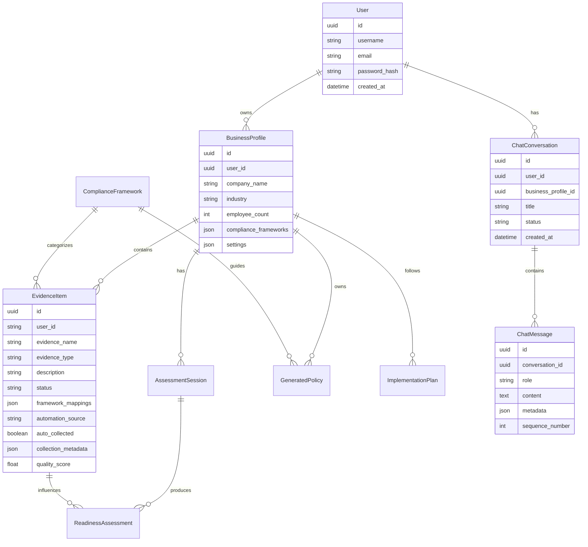

# ComplianceGPT Component Relationships

## System Architecture Overview

ComplianceGPT follows a layered service-oriented architecture with clear separation of concerns:

```
┌─────────────────────────────────────────────────────────────┐
│                        API Layer                            │
│  ┌─────────────┐ ┌─────────────┐ ┌─────────────┐           │
│  │   FastAPI   │ │ Middleware  │ │   Routers   │           │
│  │  main.py    │ │   (Auth,    │ │ (Endpoints) │           │
│  │             │ │ Rate Limit) │ │             │           │
│  └─────────────┘ └─────────────┘ └─────────────┘           │
└─────────────────────────────────────────────────────────────┘
                              │
                              ▼
┌─────────────────────────────────────────────────────────────┐
│                      Service Layer                          │
│  ┌─────────────┐ ┌─────────────┐ ┌─────────────┐           │
│  │  Business   │ │ AI Services │ │ Automation  │           │
│  │  Services   │ │             │ │  Services   │           │
│  │             │ │ (Gemini AI) │ │             │           │
│  └─────────────┘ └─────────────┘ └─────────────┘           │
└─────────────────────────────────────────────────────────────┘
                              │
                              ▼
┌─────────────────────────────────────────────────────────────┐
│                      Data Layer                             │
│  ┌─────────────┐ ┌─────────────┐ ┌─────────────┐           │
│  │ PostgreSQL  │ │ SQLAlchemy  │ │    Redis    │           │
│  │  Database   │ │   Models    │ │   Cache     │           │
│  │             │ │             │ │             │           │
│  └─────────────┘ └─────────────┘ └─────────────┘           │
└─────────────────────────────────────────────────────────────┘
                              │
                              ▼
┌─────────────────────────────────────────────────────────────┐
│                   Background Processing                     │
│  ┌─────────────┐ ┌─────────────┐ ┌─────────────┐           │
│  │   Celery    │ │   Workers   │ │   Queues    │           │
│  │   Broker    │ │   Tasks     │ │ (Evidence,  │           │
│  │   (Redis)   │ │             │ │ Reporting)  │           │
│  └─────────────┘ └─────────────┘ └─────────────┘           │
└─────────────────────────────────────────────────────────────┘
```

## Component Dependency Matrix

### Core Dependencies

| Component | Depends On | Dependency Type | Purpose |
|-----------|------------|----------------|---------|
| **FastAPI App** | All Routers | Direct Import | Route registration and API composition |
| **All Routers** | Service Layer | Dependency Injection | Business logic execution |
| **Service Layer** | Database Models | Direct Import | Data persistence and retrieval |
| **Service Layer** | External APIs | HTTP/OAuth | Integration functionality |
| **Background Tasks** | Service Layer | Direct Import | Async business operations |
| **AI Services** | Google Gemini | HTTP API | AI processing and content generation |
| **Automation Services** | OAuth Providers | HTTP/OAuth | External data collection |

### Database Dependencies



## Service Layer Dependencies

### Authentication Flow
```
HTTP Request → FastAPI Middleware → JWT Validation → Database User Lookup → 
Role Authorization → Service Method Access → Business Logic Execution
```

### Evidence Collection Pipeline
```
Scheduler Trigger → Celery Task → OAuth Authentication → External API Call → 
Data Processing → Quality Scoring → Database Storage → Notification Dispatch
```

### AI Assistant Pipeline
```
User Message → Context Collection → Intent Classification → AI API Call → 
Response Processing → Database Update → Response Delivery
```

### Report Generation Pipeline
```
Report Request → Data Aggregation → Template Processing → PDF Generation → 
File Storage → Email Distribution → Status Update
```

## External Service Dependencies

### Required External Services

#### Google Gemini AI
- **Purpose**: Primary AI service for content generation and analysis
- **Dependency Type**: HTTP API with API key authentication
- **Used By**: AI Services (`services/ai/`)
- **Fallback**: None (critical dependency)
- **Rate Limits**: API quota managed
- **Error Handling**: Retry logic with exponential backoff

#### PostgreSQL Database
- **Purpose**: Primary data persistence
- **Dependency Type**: Database connection via SQLAlchemy
- **Used By**: All service layers
- **Connection Management**: Connection pooling
- **Migration Strategy**: Alembic-based schema management

#### Redis Cache/Broker
- **Purpose**: Caching and message broker for Celery
- **Dependency Type**: TCP connection
- **Used By**: Celery tasks, caching layer
- **Fallback**: Task execution becomes synchronous
- **Persistence**: Configurable (recommended for production)

### Optional External Services

#### OpenAI GPT
- **Purpose**: Secondary AI service for specialized tasks
- **Dependency Type**: HTTP API with API key authentication
- **Used By**: AI Services (fallback or specialized operations)
- **Fallback**: Use Google Gemini exclusively

#### SMTP Server
- **Purpose**: Email notifications and report distribution
- **Dependency Type**: SMTP connection
- **Used By**: Notification tasks
- **Fallback**: Log notifications instead of sending

#### Google Workspace OAuth
- **Purpose**: Evidence collection from Google services
- **Dependency Type**: OAuth 2.0 flow
- **Used By**: Integration services
- **Fallback**: Manual evidence collection only

## Configuration Dependencies

### Environment Variables

| Variable | Component | Required | Default | Purpose |
|----------|-----------|----------|---------|---------|
| `DATABASE_URL` | All Services | Yes | None | PostgreSQL connection |
| `REDIS_URL` | Celery, Cache | Yes | `redis://localhost:6379/0` | Redis connection |
| `SECRET_KEY` | Authentication | Yes | None | JWT signing key |
| `GOOGLE_API_KEY` | AI Services | Yes | None | Google Gemini access |
| `OPENAI_API_KEY` | AI Services | No | None | OpenAI access |
| `ALLOWED_ORIGINS` | CORS | No | `["*"]` | Frontend origin whitelist |
| `SMTP_*` | Notifications | No | None | Email configuration |

### Feature Flags

| Flag | Component | Purpose | Default |
|------|-----------|---------|---------|
| `ENABLE_AI_ASSISTANT` | AI Services | Toggle chat functionality | `True` |
| `ENABLE_AUTO_EVIDENCE` | Automation | Toggle automated collection | `True` |
| `ENABLE_NOTIFICATIONS` | Background Tasks | Toggle email notifications | `True` |
| `ENABLE_MONITORING` | All Components | Toggle metrics collection | `True` |

## Runtime Dependencies

### Startup Sequence
1. **Configuration Loading**: Environment variables and settings
2. **Database Connection**: PostgreSQL connection establishment
3. **Redis Connection**: Cache and broker connectivity
4. **External Service Validation**: AI and OAuth service checks
5. **Database Migration**: Alembic schema updates
6. **FastAPI Application**: Router registration and middleware setup
7. **Background Workers**: Celery worker initialization
8. **Health Check**: System readiness validation

### Shutdown Sequence
1. **HTTP Server**: Stop accepting new requests
2. **Background Tasks**: Graceful task completion
3. **Database Connections**: Close connection pools
4. **Redis Connections**: Close cache connections
5. **File Handles**: Clean up temporary files
6. **Logging**: Flush log buffers

## Error Handling & Circuit Breakers

### External Service Resilience

#### AI Service Circuit Breaker
```python
# Implemented in services/ai/assistant.py
@circuit_breaker(failure_threshold=5, recovery_timeout=60)
async def call_ai_service(self, prompt: str) -> str:
    # AI service call with automatic fallback
    pass
```

#### Database Connection Pool
```python
# Implemented in database/db_setup.py
engine = create_engine(
    DATABASE_URL,
    pool_size=20,
    max_overflow=30,
    pool_pre_ping=True,
    pool_recycle=3600
)
```

#### Redis Fallback Strategy
```python
# Implemented in cache layer
def cache_get(key: str) -> Optional[Any]:
    try:
        return redis_client.get(key)
    except RedisConnectionError:
        logger.warning("Redis unavailable, cache miss")
        return None
```

## Performance Dependencies

### Database Query Optimization
- **Connection Pooling**: 20 base connections, 30 overflow
- **Query Optimization**: Proper indexing on frequently queried columns
- **Lazy Loading**: Selective relationship loading
- **Bulk Operations**: Batch processing for large datasets

### Cache Strategy
- **Session Caching**: User session data in Redis
- **Query Result Caching**: Expensive query results cached
- **API Response Caching**: Static data cached with TTL
- **Template Caching**: Compiled templates cached in memory

### Background Task Optimization
- **Queue Separation**: Different queues for different task types
- **Worker Scaling**: Horizontal scaling based on queue length
- **Task Prioritization**: Critical tasks prioritized
- **Batch Processing**: Related tasks batched for efficiency

## Monitoring Dependencies

### Health Checks
```python
# Health check endpoints monitor all dependencies
@app.get("/health")
async def health_check():
    checks = {
        "database": check_database_connection(),
        "redis": check_redis_connection(),
        "ai_service": check_ai_service_availability(),
        "file_storage": check_file_storage_access()
    }
    return {"status": "healthy" if all(checks.values()) else "degraded", "checks": checks}
```

### Metrics Collection
- **Request Metrics**: Response times, error rates, throughput
- **Database Metrics**: Connection pool usage, query performance
- **Background Task Metrics**: Queue lengths, task completion rates
- **External Service Metrics**: API response times, failure rates

## Development Dependencies

### Testing Dependencies
- **Test Database**: Isolated test database for integration tests
- **Mock Services**: External service mocking for unit tests
- **Load Testing**: Locust for performance validation
- **Coverage Analysis**: Code coverage reporting

### Development Tools
- **Hot Reload**: FastAPI development server with auto-reload
- **Database Migrations**: Alembic for schema changes
- **Code Formatting**: Black, isort for consistent formatting
- **Linting**: Flake8 for code quality checks

---

This component relationship documentation provides a comprehensive view of how all parts of the ComplianceGPT system interact, their dependencies, and operational considerations for maintaining system reliability and performance.