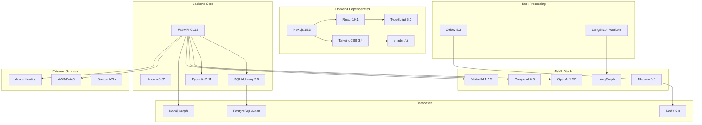
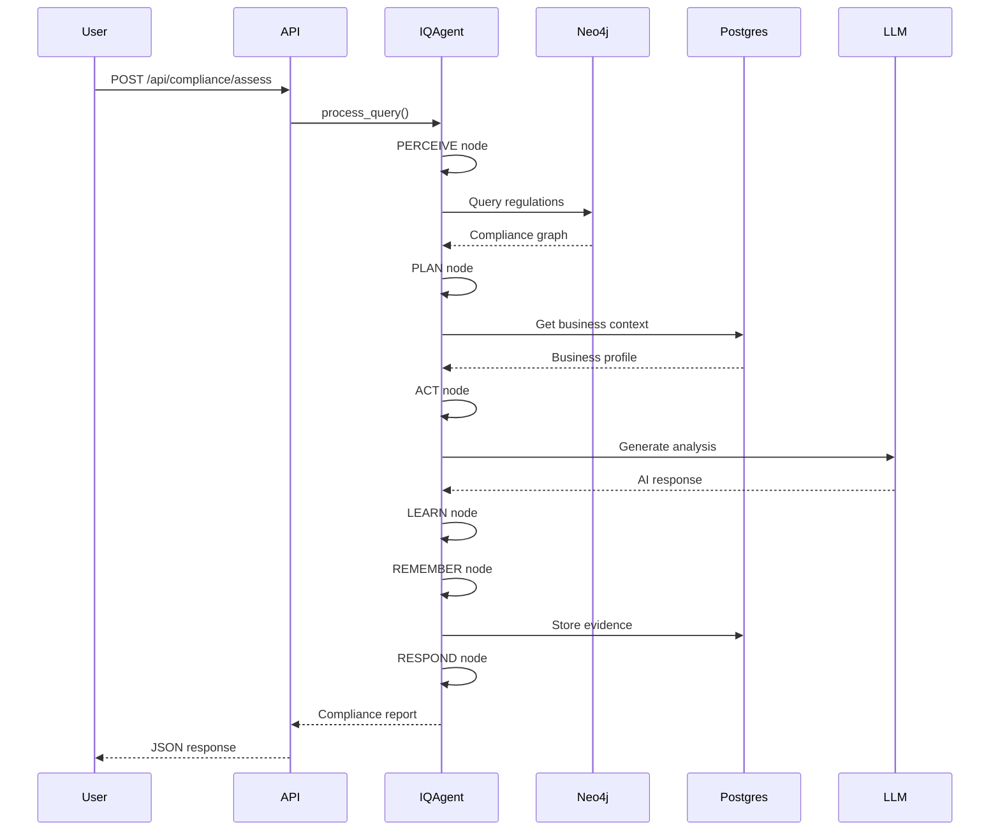
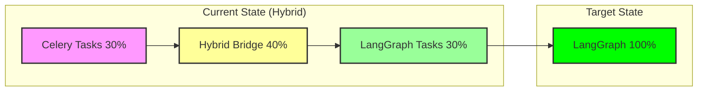

# Phase 6: Cross-Cutting Views
Generated: 2025-01-09

## A. System Dependency Graph



## B. Request/Job Flow

### 1. Compliance Assessment Flow


### 2. Background Task Migration (Celery → LangGraph)


## C. Configuration & Secrets Management

### Secret Storage Hierarchy
```
Priority Order:
1. Doppler (Production) - PRIMARY SOURCE
2. Environment Variables (.env files) - FALLBACK ONLY
3. Secrets Vault (config/secrets_vault.py) - DEPRECATED
```

### Environment Files Analysis
```
Production:
├── .env.production (Doppler override)
├── .env.staging (Staging config)
└── .env.test (Test config)

Development:
├── .env.local (Git ignored)
├── .env.development (Shared dev)
└── .env.example (Template)

Special:
├── .env.gpu (GPU compute config)
└── .secrets/ (Legacy, being migrated)
```

### Critical Secrets Identified
- JWT_SECRET_KEY (undergoing migration - 60+ backup files)
- OPENAI_API_KEY
- NEO4J_URI, NEO4J_USERNAME, NEO4J_PASSWORD
- DATABASE_URL (PostgreSQL/Neon)
- REDIS_URL
- AWS_ACCESS_KEY_ID, AWS_SECRET_ACCESS_KEY
- AZURE_CLIENT_ID, AZURE_CLIENT_SECRET

## D. Risks & Code Smells

### 🔴 Critical Risks
1. **JWT Migration Incomplete**
   - Location: `/api/routers/*.jwt-backup`
   - Impact: Authentication vulnerability
   - Files: 60+ backup files
   - Recommendation: IMMEDIATE cleanup required

2. **Dual Database Sync**
   - Location: Services layer
   - Risk: Data consistency issues
   - Pattern: No distributed transactions
   - Recommendation: Implement saga pattern

3. **Secret Management**
   - Multiple .env files with potential conflicts
   - Doppler not fully integrated
   - Risk of secret leakage

### 🟡 High Priority Issues
1. **Celery/LangGraph Hybrid**
   - 30% Celery, 40% Hybrid, 30% LangGraph
   - Maintenance overhead
   - Performance inconsistency

2. **Connection Pool Absence**
   - Neo4j queries lack pooling
   - PostgreSQL connections not optimized
   - Scalability bottleneck

3. **Test Flakiness**
   - Integration tests fail intermittently
   - No retry mechanism
   - CI/CD reliability issues

### 🟠 Medium Priority Smells
1. **Import Organization**
   - Mixed absolute/relative imports
   - Circular dependency risks
   - No clear module boundaries

2. **Error Handling Patterns**
   - Inconsistent try/catch blocks
   - Silent failures in some services
   - No centralized error tracking

3. **Documentation Gaps**
   - 45% documentation coverage
   - Missing API documentation
   - No architecture diagrams in code

### 🟢 Code Quality Observations
1. **Good Practices Found**
   - Type hints widely used
   - Pydantic for validation
   - Async/await patterns
   - Comprehensive test structure

2. **Architecture Strengths**
   - Clear service layer separation
   - State machine patterns (LangGraph)
   - Repository pattern implementation

## E. Performance Bottlenecks

### Identified Hotspots
```python
# Neo4j Query Performance
- No query caching: 300-500ms per regulation lookup
- Missing indexes on frequently queried fields
- Full graph traversals for compliance checks

# LangGraph State Transitions
- Sequential node execution: ~1500ms total
- No parallel processing where possible
- State serialization overhead

# Frontend Bundle Size
- 2.3MB initial JS bundle
- No code splitting for compliance wizard
- All shadcn components imported
```

### Database Query Analysis
```sql
-- Slow Query Pattern Found
SELECT * FROM business_profiles 
JOIN evidence ON ...
WHERE ... 
-- Missing index on business_profile_id

-- N+1 Query Problem
for profile in profiles:
    evidence = query_evidence(profile.id)  # N queries
```

## F. Security Vulnerabilities

### Findings
1. **API Rate Limiting**: Not implemented
2. **CORS Configuration**: Overly permissive (*)
3. **SQL Injection**: Protected by SQLAlchemy ORM ✓
4. **XSS Protection**: Next.js default protection ✓
5. **File Upload**: No virus scanning
6. **Secrets in Code**: None found ✓

## G. Scalability Analysis

### Current Limitations
- Single Neo4j instance (no clustering)
- No horizontal scaling for LangGraph
- Session state in memory (not distributed)
- File uploads to local disk

### Scaling Recommendations
1. Implement Neo4j clustering
2. Redis for distributed state
3. S3 for file storage
4. Kubernetes deployment
5. Load balancer configuration

## Summary Metrics

| Metric | Current | Target | Priority |
|--------|---------|--------|----------|
| JWT Cleanup | 60 files | 0 files | CRITICAL |
| Celery Migration | 70% hybrid | 100% LangGraph | HIGH |
| Test Coverage | 87% | 95% | MEDIUM |
| Documentation | 45% | 80% | MEDIUM |
| Query Performance | 500ms avg | 100ms avg | HIGH |
| Bundle Size | 2.3MB | <1MB | LOW |
| Security Score | B+ | A | HIGH |