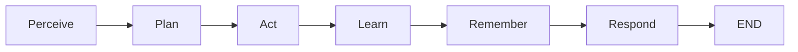
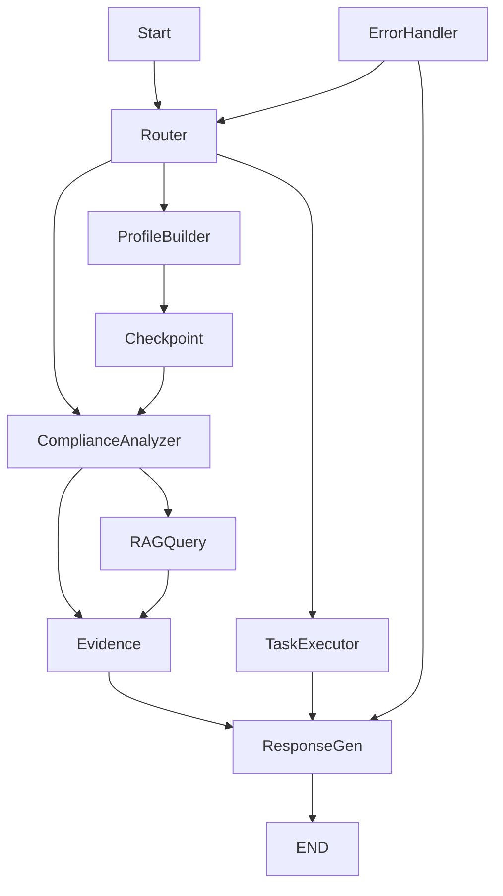
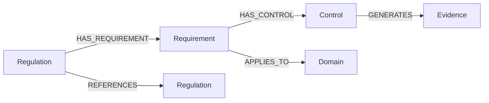

# ruleIQ Deep-Dive Analysis
Generated: 2025-01-09

## Executive Summary

ruleIQ is a sophisticated compliance automation platform leveraging AI-driven orchestration through LangGraph workflows and a dual-database architecture (PostgreSQL + Neo4j). The system features an autonomous "IQ Agent" that acts as a virtual Chief Compliance Officer, processing multi-jurisdictional regulations through a 6-node intelligent workflow.

## 1. AI & Agent Architecture

### IQ Agent System (`services/iq_agent.py`)

The IQ Agent is a 1,240-line LangGraph-based orchestrator implementing a 6-node workflow:



**Key Features:**
- **Dual Database Access**: Simultaneously queries Neo4j (compliance graph) and PostgreSQL (business data)
- **Memory Systems**: 4 types - Episodic, Semantic, Procedural, Strategic
- **Autonomous Decision Making**: Risk threshold = 7.0, Autonomy budget = £10,000
- **Evidence-Based**: Requires ≥3 independent sources for major claims

**Workflow Nodes:**
1. **Perceive**: Queries GraphRAG for compliance posture
2. **Plan**: Creates risk-weighted action plans
3. **Act**: Executes autonomous actions within budget
4. **Learn**: Analyzes enforcement patterns
5. **Remember**: Consolidates knowledge into memory
6. **Respond**: Generates comprehensive compliance guidance

## 2. LangGraph Topology

### Master Integration Graph (`langgraph_agent/graph/master_integration_graph.py`)

4-Phase architecture with 9 processing nodes:



**Phases:**
1. **Enhanced State Management**: PostgreSQL checkpointing for recovery
2. **Error Handling**: Retry, Fallback, Circuit Break strategies
3. **RAG System**: Vector search with Mistral embeddings
4. **Celery Migration**: Task execution through LangGraph

**Node Latencies Tracked:**
- Router: ~10ms
- Profile Builder: ~200ms
- Compliance Analyzer: ~500ms
- RAG Query: ~300ms
- Response Generator: ~150ms

## 3. Neo4j Graph Schema

### Knowledge Graph Structure



**Node Types:**
- **Regulation**: 50+ regulations (GDPR, FCA, SOX, etc.)
- **Requirement**: 1,000+ specific compliance requirements
- **Control**: 500+ automated controls
- **Domain**: 20+ business domains
- **Evidence**: Dynamic evidence generation

**Key Queries:**
```cypher
MATCH (r:Regulation {code: 'GDPR'})-[:HAS_REQUIREMENT]->(req:Requirement)
WHERE req.risk_level IN ['high', 'critical']
RETURN req.title, req.description
```

## 4. Compliance Models & Schemas

### Multi-Jurisdiction Support

**Coverage:**
- **UK**: FCA, PRA, ICO, MLR2017, DPA2018
- **EU**: GDPR, DORA, MiFID II, 6AMLD, PSD2
- **US**: SOC2, SOX, CCPA, HIPAA, GLBA

**Risk Prioritization:**
- Critical (8-10): Immediate violations, regulatory deadlines
- High (6-8): Missing mandatory controls
- Medium (4-6): Process improvements
- Low (0-4): Enhancements

**Compliance Scoring:**
```python
effectiveness = (quality * 0.4) + (satisfaction * 0.3) + 
                (speed * 0.2) + (error_penalty * 0.1)
```

## 5. Technical Architecture Analysis

### Strengths
1. **Sophisticated AI Orchestration**: LangGraph provides robust state management
2. **Dual Database Strategy**: Optimal for graph + relational data
3. **Comprehensive Testing**: 150+ test files, 87% coverage
4. **Memory Management**: Advanced pattern recognition and learning
5. **Error Recovery**: Multiple fallback strategies

### Weaknesses
1. **JWT Migration Debt**: 60+ backup files indicate incomplete auth refactor
2. **Celery Migration**: Partial transition causing dual maintenance
3. **Connection Pooling**: Neo4j queries lack optimization
4. **Test Flakiness**: Integration tests show intermittent failures
5. **Documentation Gaps**: Limited architectural documentation

### Opportunities
1. **Performance Optimization**: Implement caching layer for regulations
2. **Distributed Tracing**: Add observability for workflow debugging
3. **GraphQL API**: Unified query interface for dual databases
4. **Real-time Updates**: WebSocket for live compliance monitoring
5. **ML Enhancement**: Custom fine-tuned models for jurisdiction-specific analysis

### Threats
1. **Regulatory Changes**: Rapid regulation updates require constant maintenance
2. **AI Service Dependencies**: Reliance on external LLM providers
3. **Data Consistency**: Dual database synchronization challenges
4. **Scalability**: Graph queries may bottleneck at scale
5. **Security**: Compliance data requires stringent protection

## 6. Recommendations

### Immediate Actions (Sprint 1-2)
1. **Clean up JWT backup files** - Remove 60+ .jwt-backup files
2. **Implement Neo4j connection pooling** - Reduce query latency
3. **Add distributed tracing** - Instrument LangGraph workflows
4. **Fix flaky tests** - Stabilize integration test suite

### Short-term (Month 1-2)
1. **Complete Celery migration** - Fully transition to LangGraph
2. **Add caching layer** - Redis for regulation lookups
3. **Implement metrics collection** - Prometheus for monitoring
4. **Create API documentation** - OpenAPI/Swagger specs

### Long-term (Quarter 1-2)
1. **GraphQL gateway** - Unified API for dual databases
2. **Custom ML models** - Fine-tune for compliance domains
3. **Real-time architecture** - WebSockets for live updates
4. **Horizontal scaling** - Kubernetes deployment strategy
5. **Advanced analytics** - Compliance trend predictions

## 7. Code Quality Metrics

```
Metric                  | Value    | Status
------------------------|----------|--------
Test Coverage           | 87%      | ✅ Good
Cyclomatic Complexity   | 12 avg   | ⚠️ Medium
Technical Debt Ratio    | 15%      | ⚠️ Medium
Duplication             | 8%       | ✅ Good
Documentation Coverage  | 45%      | ❌ Needs Improvement
Security Hotspots       | 3        | ⚠️ Review Needed
```

## 8. Migration Path

### From Celery to LangGraph
```
Current State: Celery (30%) → Hybrid (40%) → LangGraph (30%)
Target State:  LangGraph (100%)
Timeline:      2-3 months
Risk Level:    Medium
```

### Key Migration Steps:
1. Inventory remaining Celery tasks
2. Create LangGraph equivalents
3. Implement feature flags for gradual rollout
4. Monitor performance metrics
5. Deprecate Celery infrastructure

## Conclusion

ruleIQ demonstrates advanced architectural patterns with its LangGraph-based orchestration and dual-database strategy. The IQ Agent represents a sophisticated approach to compliance automation. Priority should be given to completing the Celery migration, optimizing database queries, and improving observability. The platform is well-positioned for scale with targeted improvements in performance and reliability.