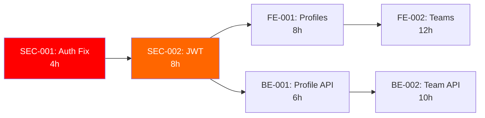

# RuleIQ Master Task List - January 2025
## Complete Consolidated Task Inventory

---

## 📊 TASK SUMMARY
- **Total Tasks**: 24 defined tasks
- **P0 (Critical)**: 4 tasks - 20 hours
- **P1 (High)**: 12 tasks - 94 hours  
- **P2 (Medium)**: 8 tasks - 86 hours (includes AI tasks not in original)
- **Total Effort**: 200+ engineer-hours
- **Timeline**: 3-4 weeks with parallel teams

---

## 🚨 P0 - CRITICAL SECURITY (24-48 HOURS)

| ID | Task | Owner | Hours | Dependencies | Status |
|----|------|-------|-------|--------------|--------|
| SEC-001 | Fix authentication middleware bypass | Sr. Backend | 4 | None | **🔴 NOT STARTED** |
| SEC-002 | Implement JWT validation | Full-Stack | 8 | SEC-001 | **⚪ BLOCKED** |
| SEC-003 | Add rate limiting middleware | Backend | 6 | SEC-001 | **⚪ BLOCKED** |
| SEC-004 | Implement CORS configuration | Backend | 2 | SEC-001 | **⚪ BLOCKED** |

**Critical Path**: SEC-001 → SEC-002 → All other features

---

## 👥 P1 - USER MANAGEMENT & CORE FEATURES (WEEK 1)

### Frontend Tasks
| ID | Task | Owner | Hours | Dependencies | Status |
|----|------|-------|-------|--------------|--------|
| FE-001 | Create user profile page | Frontend | 8 | SEC-002 | **⚪ BLOCKED** |
| FE-002 | Build team management UI | Frontend | 12 | FE-001 | **⚪ BLOCKED** |
| FE-003 | Implement onboarding wizard | Frontend | 16 | SEC-002 | **⚪ BLOCKED** |
| FE-004 | Add global error boundaries | Frontend | 6 | None | **🟡 READY** |
| FE-005 | Fix accessibility violations | Frontend | 8 | None | **🟡 READY** |

### Backend Tasks
| ID | Task | Owner | Hours | Dependencies | Status |
|----|------|-------|-------|--------------|--------|
| BE-001 | Create user profile endpoints | Backend | 6 | SEC-002 | **⚪ BLOCKED** |
| BE-002 | Build team management API | Backend | 10 | BE-001 | **⚪ BLOCKED** |
| BE-003 | Implement onboarding API | Backend | 8 | SEC-002 | **⚪ BLOCKED** |
| BE-004 | Add comprehensive logging | Backend | 6 | None | **🟡 READY** |

### Accessibility Tasks
| ID | Task | Owner | Hours | Dependencies | Status |
|----|------|-------|-------|--------------|--------|
| A11Y-001 | Fix color contrast ratios | UI Dev | 8 | None | **🟡 READY** |
| A11Y-002 | Add ARIA labels everywhere | Frontend | 12 | None | **🟡 READY** |
| A11Y-003 | Implement keyboard navigation | Frontend | 16 | None | **🟡 READY** |

---

## 🚀 P2 - PERFORMANCE & OPTIMIZATION (WEEK 2)

| ID | Task | Owner | Hours | Dependencies | Status |
|----|------|-------|-------|--------------|--------|
| PERF-001 | Implement code splitting | Frontend | 8 | None | **🟡 READY** |
| PERF-002 | Add image optimization | Frontend | 4 | None | **🟡 READY** |
| PERF-003 | Implement virtual scrolling | Frontend | 6 | None | **🟡 READY** |
| PERF-004 | Add Redis caching layer | Backend | 10 | None | **🟡 READY** |

---

## 🤖 P2 - AI ENHANCEMENT (WEEK 2-3)

| ID | Task | Owner | Hours | Dependencies | Status |
|----|------|-------|-------|--------------|--------|
| AI-001 | Setup RAG pipeline | ML Eng | 24 | None | **🟡 READY** |
| AI-002 | Conversational assessment | Full-Stack | 20 | AI-001 | **⚪ BLOCKED** |
| AI-003 | Hallucination prevention | ML Eng | 16 | AI-001 | **⚪ BLOCKED** |

---

## 🏗️ P2 - INFRASTRUCTURE (WEEK 2-3)

| ID | Task | Owner | Hours | Dependencies | Status |
|----|------|-------|-------|--------------|--------|
| INFRA-001 | Setup monitoring (Prometheus/Grafana) | DevOps | 12 | None | **🟡 READY** |
| INFRA-002 | Configure CI/CD pipeline | DevOps | 8 | None | **🟡 READY** |
| INFRA-003 | Implement error boundaries | Full-Stack | 8 | None | **🟡 READY** |

---

## 📈 TASK STATUS LEGEND

- **🔴 NOT STARTED** - Critical tasks not begun
- **🟡 READY** - Can start immediately (no blockers)
- **⚪ BLOCKED** - Waiting on dependencies
- **🔵 IN PROGRESS** - Currently being worked on
- **✅ COMPLETE** - Finished and tested

---

## 🎯 EXECUTION SEQUENCE

### Day 1-2 (EMERGENCY)
```
1. SEC-001: Fix auth bypass (4h) 🔴
2. SEC-002: JWT implementation (8h)
3. SEC-003: Rate limiting (6h)
4. SEC-004: CORS config (2h)
```

### Week 1 (PARALLEL TRACKS)
```
Track A - User Features:
- FE-001: User profiles (8h)
- BE-001: Profile API (6h)
- FE-002: Team UI (12h)
- BE-002: Team API (10h)

Track B - Quality:
- FE-004: Error boundaries (6h)
- FE-005: Accessibility (8h)
- A11Y-001: Contrast (8h)
- A11Y-002: ARIA (12h)

Track C - Foundation:
- BE-004: Logging (6h)
- FE-003: Onboarding (16h)
- BE-003: Onboarding API (8h)
```

### Week 2 (OPTIMIZATION)
```
Track A - Performance:
- PERF-001: Code splitting (8h)
- PERF-002: Images (4h)
- PERF-003: Scrolling (6h)
- PERF-004: Redis (10h)

Track B - Infrastructure:
- INFRA-001: Monitoring (12h)
- INFRA-002: CI/CD (8h)
- INFRA-003: Error handling (8h)
```

### Week 3-4 (AI FEATURES)
```
- AI-001: RAG setup (24h)
- AI-002: Chat interface (20h)
- AI-003: Quality control (16h)
```

---

## 📋 QUICK FILTERS

### Tasks You Can Start NOW (No Blockers):
1. FE-004: Global error boundaries (6h)
2. FE-005: Fix accessibility (8h)
3. BE-004: Add logging (6h)
4. A11Y-001: Fix contrast (8h)
5. A11Y-002: Add ARIA labels (12h)
6. A11Y-003: Keyboard nav (16h)
7. All PERF tasks (28h total)
8. All INFRA tasks (28h total)

### Tasks Blocked by Security Fix:
- ALL user management features
- ALL team features
- Onboarding wizard
- Most backend APIs

### Solo Developer Tasks:
- FE-004: Error boundaries
- FE-005: Accessibility fixes
- BE-004: Logging
- PERF-002: Image optimization

### Team Required Tasks:
- SEC-001 + SEC-002 (coordinated fix)
- FE-001 + BE-001 (profile feature)
- FE-002 + BE-002 (team feature)
- AI-001 → AI-002 → AI-003 (sequential)

---

## 🚦 CRITICAL PATH



---

## 📞 ASSIGNMENTS NEEDED

### Immediate Assignments Required:
1. **Security Lead**: Own SEC-001 through SEC-004
2. **Frontend Lead**: Coordinate FE-001 through FE-005
3. **Backend Lead**: Manage BE-001 through BE-004
4. **UX Lead**: Drive A11Y-001 through A11Y-003
5. **DevOps Lead**: Handle INFRA tasks
6. **ML Lead**: Own AI pipeline tasks

---

## 📊 METRICS TO TRACK

### Daily Metrics:
- Tasks started vs completed
- Blockers identified
- Hours burned vs estimated
- Test coverage %
- Security scan results

### Weekly Targets:
- Week 1: Security fixed, user management live
- Week 2: Performance optimized, monitoring active
- Week 3: AI features beta, full test coverage
- Week 4: Production ready, all P0/P1 complete

---

**Document Status**: MASTER LIST READY
**Total Tasks**: 24 + 3 accessibility = 27
**Ready to Start**: 13 tasks (112 hours)
**Blocked**: 14 tasks (88 hours)
**Critical Blocker**: SEC-001 (4 hours)