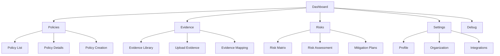
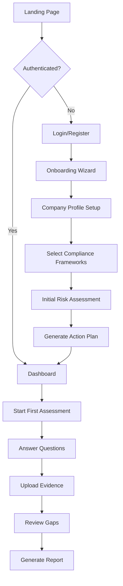

# RuleIQ UI/UX Specification

## Introduction

This document defines the user experience goals, information architecture, user flows, and visual design specifications for RuleIQ's user interface. It documents the existing implementation and provides guidelines for future enhancements while maintaining consistency with the established design system.

## Overall UX Goals & Principles

### Target User Personas

**Based on Current Implementation:**
- **SMB Compliance Officer:** Primary users navigating Policies, Evidence, and Risks sections for regulatory compliance
- **UK Business Administrator:** Users managing evidence uploads, documentation, and compliance tracking
- **Power Users:** Advanced users utilizing keyboard shortcuts and command palette for efficient navigation

### Usability Goals

**Currently Implemented:**
- ✅ Quick navigation via always-visible sidebar
- ✅ Command palette for keyboard-first navigation
- ✅ AI chat assistance integrated (bottom-right widget)
- ✅ Dark mode support for reduced eye strain
- ✅ Clean, professional teal-based theme

**Target Metrics:**
- New user onboarding: Complete first assessment within 15 minutes
- Task efficiency: Core actions achievable in 3 clicks or less
- Error recovery: Clear guidance for all error states
- Accessibility: WCAG 2.1 AA compliance

### Design Principles

1. **Professional Simplicity** - Clean white surfaces with teal accents maintain business credibility
2. **Keyboard-First Power Features** - Command palette and shortcuts for efficiency without sacrificing discoverability
3. **AI-Assisted Workflow** - Contextual chat widget reduces learning curve
4. **Clear Information Hierarchy** - Icon+text sidebar navigation with logical grouping
5. **Progressive Disclosure** - Complex compliance made manageable through stepped workflows

## Information Architecture

### Current Site Structure



### Navigation Structure

**Primary Navigation (Sidebar):**
- Always visible on desktop
- Collapsible on mobile
- Icon + text labels for clarity
- Active state indicators

**Secondary Navigation:**
- Breadcrumbs for deep navigation
- Tab navigation within sections
- Command palette for quick access

## Gap Analysis - Missing Features

### Critical Missing Flows

1. **Authentication & Onboarding**
   - ❌ No login/register pages implemented
   - ❌ Missing password reset flow
   - ❌ No onboarding wizard for new users
   - ❌ Multi-factor authentication UI needed

2. **Core Compliance Workflows**
   - ⚠️ Policies page exists but error handling incomplete
   - ❌ No assessment creation wizard
   - ❌ Missing compliance report generation UI
   - ❌ No audit trail visualization

3. **User Management**
   - ❌ No user profile page
   - ❌ Missing team/organization management
   - ❌ No role-based access control UI

4. **Data Management**
   - ⚠️ Evidence page exists but upload flow unclear
   - ❌ No bulk operations UI
   - ❌ Missing export/import functionality

## Enhancement Recommendations

### Sidebar Navigation Enhancements

**Proposed Grouping Structure:**
```typescript
// Group compliance-related items
Compliance:
  - Policies (with active count badge)
  - Assessments (with pending indicator)
  - Evidence (with upload progress)

// Group analytics items  
Insights:
  - Risk Matrix (with risk level indicator)
  - Reports (with "new" badge for unread)
  - Analytics Dashboard
```

### Component Improvements

1. **Command Palette**
   - Add fuzzy search with relevance scoring
   - Include recent actions history
   - Show keyboard shortcuts inline
   - Support natural language commands

2. **Chat Widget**
   - Add conversation history
   - Quick action buttons for FAQs
   - File attachment for evidence
   - Compliance-specific AI prompts

3. **Quick Actions Panel**
   - Context-aware based on current page
   - Bulk operations support
   - Undo/redo functionality
   - Action history tracking

## User Flows

### Flow 1: First-Time Compliance Assessment



### Flow 2: Policy Creation (MISSING - PRIORITY)

```mermaid
graph TD
    A[Policies List Page] --> B[Click 'New Policy' Button]
    B --> C[/policies/new - MISSING PAGE]
    C --> D{Creation Method?}
    D -->|AI Generate| E[Select Framework]
    D -->|Manual| F[Blank Template]
    D -->|Import| G[Upload Existing]
    
    E --> H[Choose Policy Type]
    H -->|Comprehensive| I[Full AI Generation]
    H -->|Basic| J[Simplified Version]
    H -->|Custom| K[Add Requirements]
    
    I --> L[Review Generated Content]
    J --> L
    K --> L
    
    L --> M[Edit Sections]
    M --> N[Add Metadata]
    N --> O[Set Status]
    O -->|Draft| P[Save Draft]
    O -->|Review| Q[Submit for Review]
    
    P --> R[Return to List]
    Q --> S[Approval Workflow]
```

**Required Components:**
- Policy creation wizard
- Framework selector
- AI generation options
- Rich text editor for sections
- Metadata form (effective date, owner, etc.)
- Preview mode
- Save/Submit actions

### Flow 3: Evidence Management

**Entry Points:** Dashboard notification, Policy requirement, Assessment task

**Process:**
1. Navigate to Evidence section
2. Select evidence type (Document/Policy/External)
3. Upload or link evidence
4. AI auto-classification
5. Validation check
6. Update compliance score

**Success Criteria:** Evidence mapped to requirement, compliance score updated

### Flow 3: Risk Monitoring

**Automated Process:**
1. Risk detection engine runs continuously
2. Categorize by severity (Critical/High/Medium/Low)
3. Route notifications appropriately
4. User acknowledges and creates mitigation task
5. Track progress to resolution

## Component Library

### Current Design System

**Framework:** shadcn/ui components with Tailwind CSS

**Core Components in Use:**
- Sidebar navigation
- Cards and panels
- Buttons and controls
- Alerts and notifications
- Skeleton loaders
- Theme toggle

### Branding & Style Guide

**Color Palette:**

| Color Type | Hex Code | Usage |
|------------|----------|-------|
| Brand Primary | #2C7A7B | Primary actions, headers |
| Brand Secondary | #319795 | Secondary buttons, accents |
| Brand Tertiary | #4FD1C5 | Highlights, badges |
| Success | #10B981 | Positive states |
| Warning | #F59E0B | Cautions |
| Error | #EF4444 | Errors, destructive |
| Neutral | #71717A | Text, borders |

**Typography:**
- Font Family: Inter
- Headings: 700 weight
- Body: 400 weight
- Small text: 14px
- Base size: 16px

## Accessibility Requirements

### WCAG 2.1 AA Compliance

**Current Status:**
- ✅ Theme toggle for contrast preferences
- ✅ Semantic HTML structure
- ✅ Icon + text navigation labels
- ✅ Keyboard shortcuts support

**Required Improvements:**
- ⚠️ Increase contrast for tertiary colors (currently 2.17:1, need 4.5:1)
- ⚠️ Add ARIA labels to icon-only buttons
- ⚠️ Implement skip navigation link
- ⚠️ Add focus trap for modals
- ⚠️ Announce loading states to screen readers

### Testing Strategy
- Automated testing with axe-core
- Manual keyboard navigation testing
- Screen reader testing (NVDA/JAWS)
- Color contrast validation

## Performance Considerations

### Current Implementation
- Next.js 15.4.7 with App Router
- React Server Components
- Font optimization via next/font
- React Query for data caching

### Optimization Opportunities

1. **Bundle Size**
   - Implement dynamic imports for icons
   - Code split heavy components
   - Tree shake unused utilities

2. **Loading Performance**
   - Add image optimization with blur placeholders
   - Implement virtual scrolling for long lists
   - Use Suspense boundaries effectively

3. **Runtime Performance**
   - Debounce search inputs (300ms)
   - Implement optimistic UI updates
   - Cache API responses appropriately

### Performance Targets

| Metric | Target | Priority |
|--------|--------|----------|
| First Contentful Paint | < 1.8s | High |
| Largest Contentful Paint | < 2.5s | High |
| First Input Delay | < 100ms | Medium |
| Cumulative Layout Shift | < 0.1 | Medium |
| Time to Interactive | < 3.8s | Low |

## Responsiveness Strategy

### Breakpoints

| Breakpoint | Width | Target |
|------------|-------|--------|
| Mobile | 320-768px | Phones |
| Tablet | 768-1024px | Tablets |
| Desktop | 1024-1400px | Laptops |
| Wide | 1400px+ | Monitors |

### Adaptation Patterns
- Sidebar collapses to hamburger on mobile
- Cards stack vertically on small screens
- Tables become cards on mobile
- Modals become full-screen on mobile

## Animation & Micro-interactions

### Motion Principles
- Purpose over decoration
- Consistent timing (200ms default)
- Ease-out for user actions
- Ease-in-out for system animations

### Key Animations
- Page transitions: 200ms fade
- Sidebar toggle: 300ms slide
- Card hover: 150ms elevation
- Loading states: Skeleton pulse
- Success feedback: 400ms check animation

## Next Steps

### Immediate Actions
1. Implement authentication pages (login/register/reset)
2. Create onboarding wizard component
3. Fix accessibility issues (contrast, ARIA labels)
4. Add error boundary components
5. Implement performance monitoring

### Design Handoff Checklist
- [x] User flows documented
- [x] Component inventory complete
- [x] Accessibility requirements defined
- [x] Responsive strategy clear
- [x] Brand guidelines incorporated
- [x] Performance goals established
- [ ] Authentication flows designed
- [ ] Onboarding experience created
- [ ] Error states documented
- [ ] Empty states designed

---

*Document Version: 1.0*  
*Created: September 2024*  
*Status: In Progress - Documenting Current State*