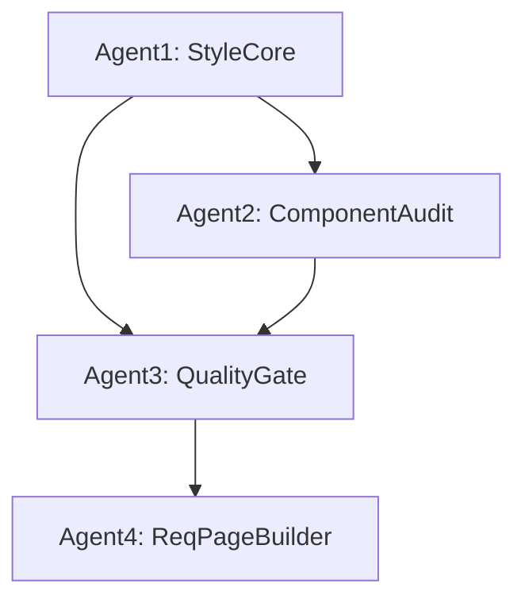

# Agent Coordination Protocol

## Execution Order & Dependencies

## Shared Signaling Files

- `_index_ops/quality_gate/style_rules.json` ← Agent1 creates, others consume
- `_index_ops/components_ready.flag` ← Agent2 creates, Agent3 waits
- `_index_ops/quality_gate/PASS.flag` ← Agent3 creates, Agent4 waits

## Repository Root
- Frontend: `/home/omar/Documents/ruleIQ/frontend`
- All operations relative to this path

## Key Deliverables (★ = Critical Output)
- Agent1: style_rules.json ★
- Agent2: components_inventory.json ★, components_decisions.md ★
- Agent3: quality_gate/report.json|md ★
- Agent4: wireframes/create-wireframe.* ★, screenshots/create-wireframe.png ★, reports/create-wireframe.json|md ★

## Failure Protocol
- Any agent encountering FAIL status must exit non-zero
- Downstream agents should check for prerequisite flags before proceeding
- Use git commits to signal completion of major deliverables