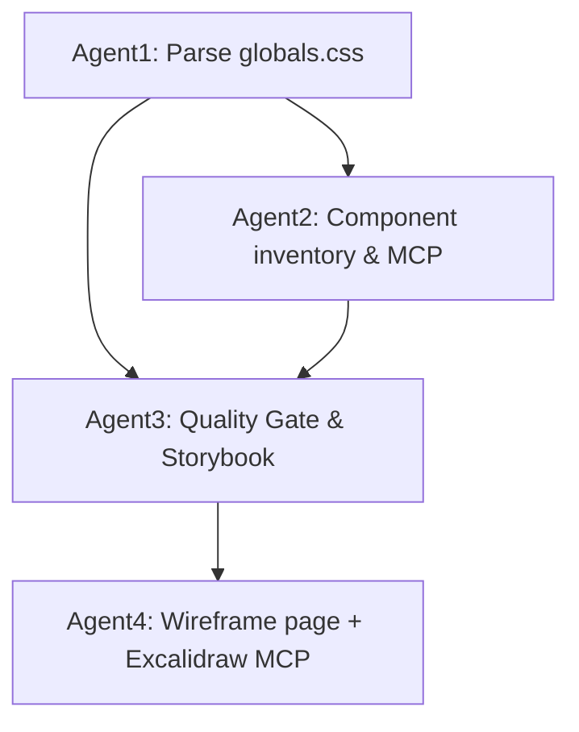

# 4-Agent Parallel Execution Summary

## ✅ Session Created Successfully 

Your **ruleIQ Frontend Audit & Component System** has been broken down into **4 specialized agents** running in parallel tmux panes, with proper dependency management and coordination.

## 🎯 Agent Breakdown

### Agent 1: STYLE-CORE (Dependency-Free)
- **Task**: Parse `styles/globals.css` & extract design tokens
- **Output**: `_index_ops/quality_gate/style_rules.json` ★
- **Status**: Ready to execute immediately

### Agent 2: COMPONENT-AUDIT (Depends: Agent 1)  
- **Task**: Inventory components, use MCP for shadcn/Aceternity generation
- **Output**: `components_inventory.json` ★, `components_decisions.md` ★
- **Status**: Waits for `style_rules.json`, then proceeds with MCP calls

### Agent 3: QUALITY-GATE + STORYBOOK (Depends: Agent 1 & 2)
- **Task**: Implement Iron-Fist Quality Gate & scaffold Storybook (dark theme)
- **Output**: `quality_gate/report.json|md` ★, `PASS.flag` signal
- **Status**: Waits for both `style_rules.json` + `components_ready.flag`

### Agent 4: REQ-PAGE BUILDER (Depends: Agent 3)
- **Task**: Create "Create Wireframe" page using Excalidraw MCP + PASS components
- **Output**: `wireframes/*` ★, `screenshots/*` ★, `reports/*` ★
- **Status**: Waits for `quality_gate/PASS.flag`

## 🚀 How to Proceed

### 1. Attach to the Tmux Session
```bash
tmux attach-session -t ruleiq_agents
```

### 2. Navigate Between Agents
- **Ctrl+b + 1** → Agent 1 (Style Core) 
- **Ctrl+b + 2** → Agent 2 (Component Audit)
- **Ctrl+b + 3** → Agent 3 (Quality Gate)
- **Ctrl+b + 4** → Agent 4 (Req Page Builder)

### 3. Monitor Progress (in separate terminal)
```bash
cd /home/omar/Documents/ruleIQ/frontend
./_index_ops/monitor_progress.sh
```

## 📋 Task Instructions Per Agent

Each agent has detailed task instructions available:
- `_index_ops/AGENT1_STYLECORE_TASKS.md`
- `_index_ops/AGENT2_COMPONENTAUDIT_TASKS.md` 
- `_index_ops/AGENT3_QUALITYGATE_TASKS.md`
- `_index_ops/AGENT4_REQPAGEBUILDER_TASKS.md`

## 🔄 Execution Flow & Dependencies



**Signaling Files:**
- `style_rules.json` → Enables Agent 2 & 3
- `components_ready.flag` → Enables Agent 3 
- `quality_gate/PASS.flag` → Enables Agent 4

## 🎛️ MCP Server Integration

The agents will leverage available MCP servers:
- **shadcn-components MCP** → Agent 2 & 3 for component generation
- **Excalidraw MCP** → Agent 4 for wireframe creation/export
- **Aceternity** → Agent 2 (if available, normalized to tokens)
- **Shell/Git/Playwright MCP** → All agents for automation

## 🏁 Expected Final Deliverables

### Core System (Prompts 1 & 2)
1. **Storybook** with dark theme + Iron-Fist Quality Gate
2. **Component Inventory & Rationalization Plan** 
3. **Style Token Registry** (`style_rules.json`)
4. **Quality Gate Reports** (PASS/WARN/FAIL status)

### Create Wireframe Page
5. **Excalidraw Wireframe Assets** (PNG + SVG)
6. **Next.js Route Implementation** (`/requirements/create-wireframe`)
7. **Screenshot & Conformance Reports**
8. **Requirement Index** (JSON + Markdown)

## ⚡ Quick Commands

```bash
# Attach to session
tmux attach-session -t ruleiq_agents

# Monitor progress
./_index_ops/monitor_progress.sh

# Check status once
./_index_ops/monitor_progress.sh --once

# Kill session (if needed)
tmux kill-session -t ruleiq_agents
```

## 🛡️ Iron-Fist Quality Standards

- **Zero tolerance** for drift from `globals.css` tokens
- **Dark mode** as default rendering context  
- **No emojis** in any code or documentation
- **WCAG AA** accessibility compliance
- **Fail fast** on any quality violations
- Only **PASS** components permitted in final deliverables

---

**Status: 🟢 READY FOR PARALLEL EXECUTION**

The complex frontend audit task has been successfully decomposed into 4 coordinated agents. Each agent knows its role, dependencies, and expected outputs. The session is active and awaiting your direction to proceed with execution.

**Next**: Attach to the tmux session and begin execution with Agent 1, or use the monitor to track progress across all agents.