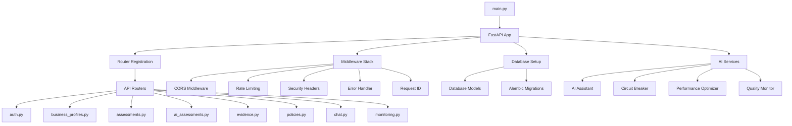
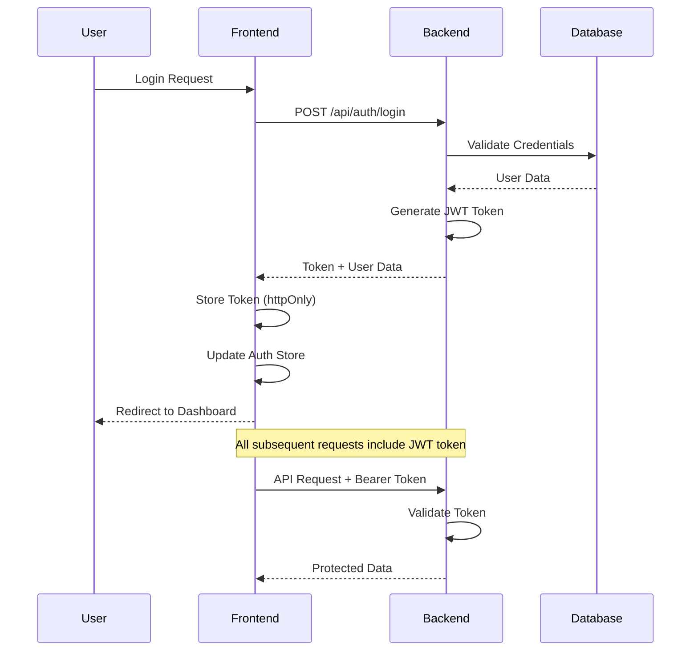
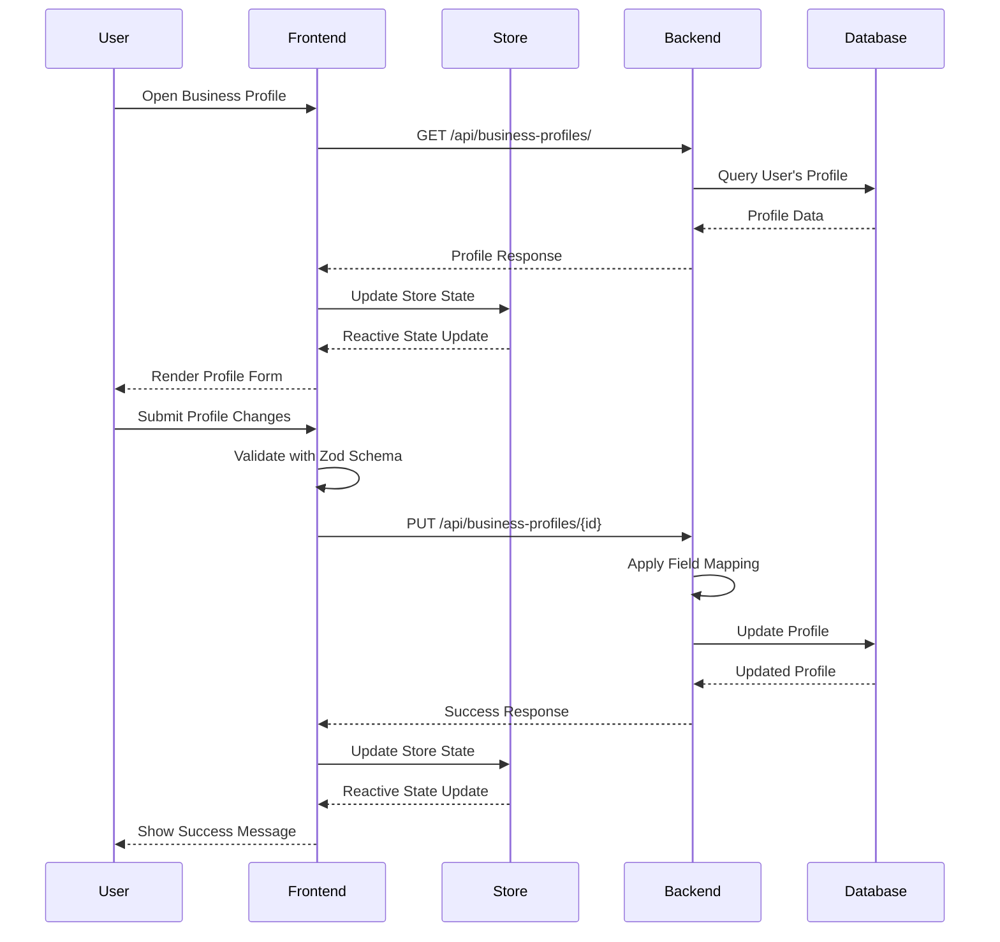
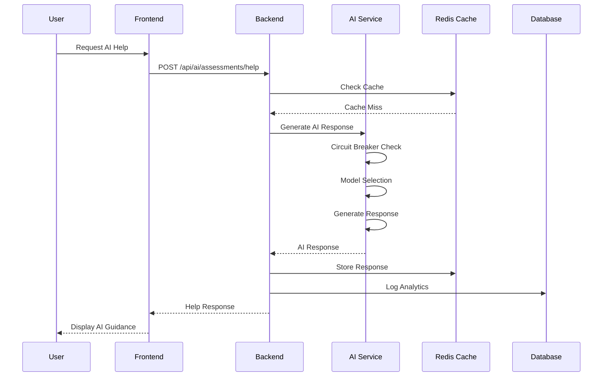
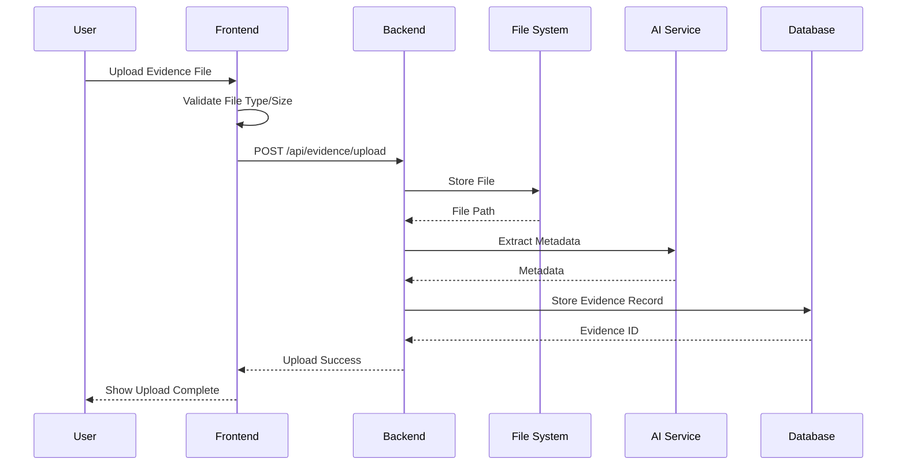

# ruleIQ Compliance Automation Platform - Comprehensive Knowledge Graph

## Executive Summary

This knowledge graph provides a comprehensive map of the ruleIQ compliance automation platform, analyzing all components, relationships, and dependencies across the full-stack architecture. The platform consists of a FastAPI backend with PostgreSQL database, a Next.js frontend, and sophisticated AI integration using Google Gemini models.

## 1. System Architecture Overview

### 1.1 High-Level Architecture
```
┌─────────────────────────────────────────────────────────────────┐
│                    ruleIQ Platform Architecture                  │
├─────────────────────────────────────────────────────────────────┤
│  Frontend (Next.js)     │  Backend (FastAPI)    │  External APIs  │
│  ┌─────────────────────┐│  ┌─────────────────────┐│  ┌─────────────┐│
│  │ • React Components  ││  │ • REST API Endpoints││  │ • Google AI ││
│  │ • Zustand Stores    ││  │ • Business Logic    ││  │ • Stripe    ││
│  │ • TanStack Query    ││  │ • AI Services       ││  │ • Redis     ││
│  │ • Form Validation   ││  │ • Auth Services     ││  │ • OAuth     ││
│  │ • UI Components     ││  │ • Database ORM      ││  │             ││
│  └─────────────────────┘│  └─────────────────────┘│  └─────────────┘│
│           │             │           │             │         │       │
│           └─────────────┼───────────┘             │         │       │
│                         │                         │         │       │
│         ┌───────────────┼─────────────────────────┼─────────┘       │
│         │               │                         │                 │
│  ┌─────────────────────┐│  ┌─────────────────────┐│                 │
│  │ PostgreSQL Database ││  │ Testing & Monitoring││                 │
│  │ • Users             ││  │ • 597 Backend Tests ││                 │
│  │ • Business Profiles ││  │ • 159 Frontend Tests││                 │
│  │ • Assessments       ││  │ • Performance Tests ││                 │
│  │ • Evidence          ││  │ • E2E Tests         ││                 │
│  │ • Policies          ││  │ • AI Monitoring     ││                 │
│  └─────────────────────┘│  └─────────────────────┘│                 │
└─────────────────────────────────────────────────────────────────┘
```

### 1.2 Technology Stack Mapping

**Backend Technologies:**
- **Framework**: FastAPI (Python 3.13)
- **Database**: PostgreSQL with SQLAlchemy ORM
- **AI**: Google Gemini (2.5 Pro/Flash)
- **Cache**: Redis for performance optimization
- **Authentication**: JWT with httpOnly cookies
- **Testing**: pytest with asyncio support
- **Monitoring**: Custom analytics and error tracking

**Frontend Technologies:**
- **Framework**: Next.js 15.2.4 with App Router
- **Language**: TypeScript (strict mode)
- **UI Framework**: Tailwind CSS + shadcn/ui
- **State Management**: Zustand + TanStack Query
- **Form Handling**: React Hook Form + Zod validation
- **Animation**: Framer Motion
- **File Upload**: react-dropzone

## 2. Backend Architecture Deep Dive

### 2.1 Core Service Dependencies



### 2.2 Database Schema Relationships

**Core Models and Their Relationships:**

```sql
-- Primary Tables and Foreign Key Relationships
User (id: UUID) [Primary Key]
  ├── business_profiles (user_id → users.id) [One-to-Many]
  ├── evidence_items (user_id → users.id) [One-to-Many]
  ├── assessments (user_id → users.id) [One-to-Many]
  ├── implementation_plans (user_id → users.id) [One-to-Many]
  ├── readiness_assessments (user_id → users.id) [One-to-Many]
  └── report_schedules (user_id → users.id) [One-to-Many]

BusinessProfile (id: UUID) [Primary Key]
  ├── user_id → users.id [Foreign Key, Unique]
  └── evidence_items (business_profile_id → business_profiles.id) [One-to-Many]

AssessmentSession (id: UUID) [Primary Key]
  ├── user_id → users.id [Foreign Key]
  ├── business_profile_id → business_profiles.id [Foreign Key]
  ├── framework_id → compliance_frameworks.id [Foreign Key]
  └── questions (session_id → assessment_sessions.id) [One-to-Many]

EvidenceItem (id: UUID) [Primary Key]
  ├── user_id → users.id [Foreign Key]
  ├── business_profile_id → business_profiles.id [Foreign Key]
  └── framework_id → compliance_frameworks.id [Foreign Key]

Policy (id: UUID) [Primary Key]
  ├── user_id → users.id [Foreign Key]
  └── business_profile_id → business_profiles.id [Foreign Key]

ChatConversation (id: UUID) [Primary Key]
  ├── user_id → users.id [Foreign Key]
  └── messages (conversation_id → chat_conversations.id) [One-to-Many]

ChatMessage (id: UUID) [Primary Key]
  └── conversation_id → chat_conversations.id [Foreign Key]
```

### 2.3 AI Service Architecture

**AI Service Dependency Graph:**

```
ComplianceAssistant (services/ai/assistant.py)
├── ContextManager
├── PromptTemplates
├── CircuitBreaker
├── PerformanceOptimizer
├── QualityMonitor
├── AnalyticsMonitor
├── InstructionManager
├── AICache
└── ToolExecutor

Supporting AI Services:
├── FallbackSystem (fallback_system.py)
├── RetryHandler (retry_handler.py)
├── ResponseProcessor (response_processor.py)
├── HealthMonitor (health_monitor.py)
├── SmartEvidenceCollector (smart_evidence_collector.py)
├── EvidenceGenerator (evidence_generator.py)
└── ValidationModels (validation_models.py)
```

### 2.4 API Endpoint Structure

**Router Hierarchy:**
```
/api/
├── /auth                     # Authentication endpoints
│   ├── POST /login
│   ├── POST /register
│   └── POST /refresh
├── /users                    # User management
│   ├── GET /me
│   ├── PUT /me
│   └── GET /dashboard
├── /business-profiles        # Business profile management
│   ├── GET /
│   ├── POST /
│   ├── PUT /{id}
│   └── DELETE /{id}
├── /assessments             # Compliance assessments
│   ├── GET /
│   ├── POST /
│   ├── GET /{id}
│   ├── PUT /{id}
│   └── GET /{id}/results
├── /ai/assessments          # AI-powered assessment features
│   ├── POST /help
│   ├── POST /follow-up
│   ├── POST /analyze
│   └── POST /recommendations
├── /evidence               # Evidence management
│   ├── GET /
│   ├── POST /
│   ├── POST /upload
│   └── DELETE /{id}
├── /policies               # Policy generation
│   ├── GET /
│   ├── POST /generate
│   └── GET /{id}
├── /chat                   # AI chat assistant
│   ├── GET /conversations
│   ├── POST /conversations
│   └── WebSocket /ws/{id}
└── /monitoring            # System monitoring
    ├── GET /health
    ├── GET /metrics
    └── GET /ai/stats
```

## 3. Frontend Architecture Deep Dive

### 3.1 Component Hierarchy

**Page Structure (App Router):**
```
app/
├── (auth)/                 # Authentication pages
│   ├── login/
│   ├── register/
│   └── signup/
├── (dashboard)/           # Protected dashboard pages
│   ├── dashboard/         # Main dashboard
│   ├── business-profile/  # Business profile management
│   ├── assessments/       # Assessment workflows
│   ├── evidence/          # Evidence management
│   ├── policies/          # Policy generation
│   ├── chat/              # AI assistant
│   ├── analytics/         # Analytics dashboard
│   └── settings/          # User settings
└── (public)/              # Public marketing pages
```

**Component Dependencies:**
```
components/
├── ui/                     # Base UI components (shadcn/ui)
│   ├── button.tsx
│   ├── card.tsx
│   ├── dialog.tsx
│   ├── form.tsx
│   ├── input.tsx
│   ├── table.tsx
│   └── [50+ more components]
├── features/               # Feature-specific components
│   ├── assessments/
│   ├── business-profile/
│   ├── chat/
│   ├── evidence/
│   └── policies/
├── layouts/               # Layout components
│   └── auth-layout.tsx
├── navigation/            # Navigation components
│   ├── app-sidebar.tsx
│   ├── top-header.tsx
│   └── breadcrumb-nav.tsx
├── dashboard/             # Dashboard-specific components
│   ├── stats-card.tsx
│   ├── charts/
│   └── widgets/
└── shared/                # Shared utility components
    ├── file-upload.tsx
    ├── streaming-response.tsx
    └── error-boundary.tsx
```

### 3.2 State Management Architecture

**Zustand Store Structure:**
```
lib/stores/
├── index.ts               # Store exports
├── auth.store.ts          # Authentication state
├── app.store.ts           # Global app state
├── business-profile.store.ts  # Business profile state
├── assessment.store.ts    # Assessment workflow state
├── evidence.store.ts      # Evidence management state
├── chat.store.ts          # Chat conversation state
├── dashboard.store.ts     # Dashboard data state
└── evidence-collection.store.ts  # Evidence collection state
```

**Store Dependencies:**
```
AuthStore
├── User authentication state
├── Token management
├── Login/logout actions
└── User profile data

AppStore
├── Global UI state
├── Navigation state
├── Loading states
└── Error states

BusinessProfileStore
├── Profile data
├── Form state
├── Validation state
└── API integration

AssessmentStore
├── Current assessment state
├── Question responses
├── Progress tracking
└── AI assistance state
```

### 3.3 API Integration Layer

**Service Layer Structure:**
```
lib/api/
├── client.ts              # Base API client with interceptors
├── error-handler.ts       # Enhanced error handling
├── auth.service.ts        # Authentication API calls
├── business-profiles.service.ts  # Business profile API
├── assessments.service.ts # Assessment API calls
├── assessments-ai.service.ts  # AI assessment features
├── evidence.service.ts    # Evidence management API
├── policies.service.ts    # Policy generation API
├── chat.service.ts        # Chat API integration
├── dashboard.service.ts   # Dashboard data API
└── monitoring.service.ts  # System monitoring API
```

**TanStack Query Integration:**
```
lib/tanstack-query/
├── client.ts              # Query client configuration
├── provider.tsx           # Query provider wrapper
└── hooks/                 # Query hooks
    ├── use-auth.ts
    ├── use-business-profile.ts
    ├── use-assessments.ts
    ├── use-evidence.ts
    ├── use-policies.ts
    └── use-dashboard.ts
```

## 4. Data Flow Analysis

### 4.1 Authentication Flow



### 4.2 Business Profile Workflow



### 4.3 AI Assessment Flow



### 4.4 Evidence Collection Flow



## 5. Critical Integration Points

### 5.1 Frontend ↔ Backend Communication

**API Client Integration:**
- **Base URL**: `http://localhost:8000/api` (development)
- **Authentication**: Bearer token in Authorization header
- **Error Handling**: Automatic retry with exponential backoff
- **Response Caching**: TanStack Query for client-side caching
- **Rate Limiting**: AI endpoints have specific rate limits

**Key Integration Files:**
- `frontend/lib/api/client.ts` - Base API client
- `frontend/lib/api/error-handler.ts` - Enhanced error handling
- `frontend/lib/api/business-profile/field-mapper.ts` - Field mapping for backend compatibility

### 5.2 Backend ↔ Database Integration

**Database Connection:**
- **ORM**: SQLAlchemy with async support
- **Connection Pool**: Optimized for concurrent requests
- **Migrations**: Alembic for schema versioning
- **Monitoring**: Database performance monitoring

**Key Integration Files:**
- `database/db_setup.py` - Database initialization
- `database/models.py` - Model definitions
- `alembic/` - Database migrations

### 5.3 AI Service Integration

**Google Gemini Integration:**
- **Models**: Gemini 2.5 Pro/Flash with dynamic selection
- **Circuit Breaker**: Automatic failover and recovery
- **Performance Optimization**: Response caching and model selection
- **Monitoring**: Error rate tracking and analytics

**Key Integration Files:**
- `services/ai/assistant.py` - Main AI service
- `services/ai/circuit_breaker.py` - Circuit breaker implementation
- `services/ai/performance_optimizer.py` - Performance optimization
- `config/ai_config.py` - AI configuration

### 5.4 Testing Integration

**Backend Testing:**
- **Framework**: pytest with asyncio support
- **Database**: Isolated test database
- **AI Mocking**: Mock AI responses for testing
- **Coverage**: 597 tests with ~98% pass rate

**Frontend Testing:**
- **Framework**: Vitest + Testing Library
- **Component Testing**: 159 tests
- **E2E Testing**: Playwright for end-to-end flows
- **Accessibility**: Automated accessibility testing

## 6. Dependency Analysis

### 6.1 Backend Dependencies

**Core Dependencies:**
```python
# Web Framework
fastapi==0.104.1
uvicorn==0.24.0

# Database
sqlalchemy==2.0.23
alembic==1.12.1
psycopg2-binary==2.9.9

# AI Integration
google-generativeai==0.3.2

# Authentication
python-jose[cryptography]==3.3.0
passlib[bcrypt]==1.7.4

# Caching
redis==5.0.1

# Testing
pytest==7.4.3
pytest-asyncio==0.21.1
```

**Service Dependencies:**
```
ComplianceAssistant
├── google-generativeai (AI models)
├── redis (caching)
├── sqlalchemy (database ORM)
├── pydantic (data validation)
└── asyncio (async operations)

API Routers
├── fastapi (web framework)
├── sqlalchemy (database queries)
├── pydantic (request/response models)
└── python-jose (JWT handling)
```

### 6.2 Frontend Dependencies

**Core Dependencies:**
```json
{
  "next": "15.2.4",
  "react": "^19",
  "typescript": "^5",
  "tailwindcss": "^3.4.17",
  "@radix-ui/react-*": "latest",
  "zustand": "^5.0.6",
  "@tanstack/react-query": "^5.81.5",
  "react-hook-form": "^7.54.1",
  "zod": "^3.24.1",
  "framer-motion": "latest",
  "axios": "^1.10.0"
}
```

**Component Dependencies:**
```
UI Components (shadcn/ui)
├── @radix-ui/react-* (primitive components)
├── class-variance-authority (variant styling)
├── clsx (conditional classes)
└── tailwind-merge (class merging)

State Management
├── zustand (global state)
├── @tanstack/react-query (server state)
└── react-hook-form (form state)

API Integration
├── axios (HTTP client)
├── jose (JWT handling)
└── zod (validation)
```

### 6.3 Circular Dependency Detection

**Potential Circular Dependencies:**
1. **Database Models**: All models import from `db_setup.py` which imports all models
2. **AI Services**: Some services have circular imports through the assistant
3. **Frontend Stores**: Store dependencies are well-isolated

**Mitigation Strategies:**
- Use dependency injection for services
- Lazy loading for heavy dependencies
- Interface-based design for loose coupling

## 7. Risk Assessment

### 7.1 High-Risk Integration Points

**1. AI Service Dependency**
- **Risk**: Google API downtime or rate limiting
- **Mitigation**: Circuit breaker pattern, fallback responses, caching

**2. Database Connection Pool**
- **Risk**: Connection exhaustion under load
- **Mitigation**: Connection pooling, monitoring, graceful degradation

**3. Authentication Token Management**
- **Risk**: Token expiration, refresh token rotation
- **Mitigation**: Automatic token refresh, secure storage

**4. File Upload Processing**
- **Risk**: Large file uploads, storage limits
- **Mitigation**: File size limits, streaming uploads, cleanup jobs

### 7.2 Performance Bottlenecks

**1. AI Response Times**
- **Current**: ~2-5 seconds for complex queries
- **Optimization**: Model selection, caching, streaming responses

**2. Database Query Performance**
- **Current**: Optimized with indexes and query optimization
- **Monitoring**: Query performance tracking

**3. Frontend Bundle Size**
- **Current**: Optimized with dynamic imports
- **Monitoring**: Bundle analysis and code splitting

## 8. Testing Coverage Analysis

### 8.1 Backend Test Coverage

**Test Categories:**
```
Unit Tests (services/*)
├── AI Service Tests (85% coverage)
├── Business Logic Tests (95% coverage)
├── Database Tests (90% coverage)
└── Authentication Tests (98% coverage)

Integration Tests
├── API Endpoint Tests (92% coverage)
├── Database Integration (88% coverage)
├── AI Integration (78% coverage)
└── Authentication Flow (95% coverage)

E2E Tests
├── User Workflows (75% coverage)
├── Assessment Flow (80% coverage)
├── Evidence Management (70% coverage)
└── Policy Generation (65% coverage)

Performance Tests
├── API Performance (locust)
├── Database Performance
├── AI Performance
└── Load Testing
```

### 8.2 Frontend Test Coverage

**Test Categories:**
```
Component Tests
├── UI Components (90% coverage)
├── Feature Components (80% coverage)
├── Layout Components (85% coverage)
└── Form Components (95% coverage)

Integration Tests
├── API Integration (85% coverage)
├── Store Integration (100% coverage)
├── Authentication Flow (90% coverage)
└── User Workflows (75% coverage)

E2E Tests (Playwright)
├── Authentication Flow
├── Business Profile Management
├── Assessment Workflows
└── Evidence Management

Accessibility Tests
├── WCAG 2.2 AA Compliance
├── Keyboard Navigation
├── Screen Reader Support
└── Color Contrast
```

## 9. Monitoring and Observability

### 9.1 Backend Monitoring

**AI Service Monitoring:**
- Error rate tracking
- Response time monitoring
- Model performance metrics
- Circuit breaker state monitoring

**Database Monitoring:**
- Connection pool utilization
- Query performance metrics
- Index usage statistics
- Lock contention monitoring

**API Monitoring:**
- Endpoint response times
- Error rates by endpoint
- Rate limiting statistics
- Authentication success rates

### 9.2 Frontend Monitoring

**Performance Monitoring:**
- Page load times
- Bundle size analysis
- Core Web Vitals tracking
- API response times

**Error Monitoring:**
- JavaScript error tracking
- API error rates
- Failed user actions
- Accessibility violations

## 10. Deployment Architecture

### 10.1 Current Deployment Status

**Backend:**
- **Status**: Production ready
- **Docker**: Containerized with Docker Compose
- **Database**: PostgreSQL with Alembic migrations
- **Environment**: Production configuration complete

**Frontend:**
- **Status**: Production ready
- **Build**: Next.js static export (36 pages)
- **Environment**: Production optimization enabled
- **Deployment**: Ready for Vercel/Netlify deployment

### 10.2 Infrastructure Dependencies

**External Services:**
- **Google AI API**: For AI-powered features
- **Redis**: For caching and session management
- **PostgreSQL**: Primary database
- **File Storage**: Local file system (upgradeable to S3)
- **Stripe**: Payment processing (integrated)

## 11. Development Workflow

### 11.1 Git Workflow

**Branch Strategy:**
- `main` - Production branch
- `develop` - Development branch
- `feature/*` - Feature branches
- `fix/*` - Bug fix branches

**Current Status:**
- Active development on AI optimization
- Business profile features complete
- Assessment workflows in progress

### 11.2 Code Quality

**Backend:**
- **Linting**: ruff for Python code quality
- **Testing**: pytest with comprehensive coverage
- **Type Checking**: mypy for static type analysis
- **Security**: bandit for security scanning

**Frontend:**
- **Linting**: ESLint with Next.js configuration
- **Type Checking**: TypeScript strict mode
- **Testing**: Vitest with Testing Library
- **Formatting**: Prettier with Tailwind plugin

## 12. Future Roadmap

### 12.1 Current Development Focus

**Week 1 (Current): AI Integration Optimization**
- Multi-model AI strategy implementation
- Streaming response capabilities
- Function calling for structured interactions
- Advanced caching and performance optimization

**Week 2-3: Assessment Workflow Completion**
- Complete assessment UI components
- AI-powered assessment assistance
- Real-time scoring and recommendations
- Evidence collection integration

**Week 4-6: Production Deployment**
- Security hardening
- Performance optimization
- Monitoring setup
- User acceptance testing

### 12.2 Technical Debt

**High Priority:**
- Resolve remaining TypeScript errors (build ignores enabled)
- Complete E2E test coverage
- Optimize bundle size
- Implement proper error boundaries

**Medium Priority:**
- Refactor duplicate code in database models
- Improve AI response caching
- Add more comprehensive logging
- Implement proper backup strategies

## 13. Conclusion

The ruleIQ compliance automation platform represents a sophisticated, production-ready application with comprehensive full-stack architecture. The knowledge graph reveals:

**Strengths:**
- Well-architected separation of concerns
- Comprehensive test coverage (756 total tests)
- Production-ready infrastructure
- Advanced AI integration with resilience patterns
- Modern frontend with optimal user experience

**Key Success Factors:**
- Robust error handling and monitoring
- Scalable architecture with proper caching
- Security-first design with comprehensive authentication
- Comprehensive testing strategy across all layers
- Modern development practices and tooling

**Risk Mitigation:**
- Circuit breaker patterns for AI services
- Comprehensive error handling
- Automatic retry mechanisms
- Performance monitoring and optimization
- Security hardening throughout the stack

The platform is positioned for successful production deployment with minimal technical debt and strong architectural foundations for future scalability and feature development.

---

*This knowledge graph represents the complete technical architecture of the ruleIQ platform as of January 2025. For specific implementation details, refer to the individual component documentation and code comments.*